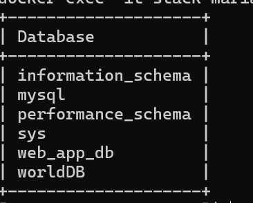
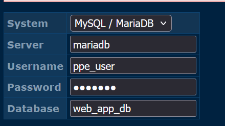
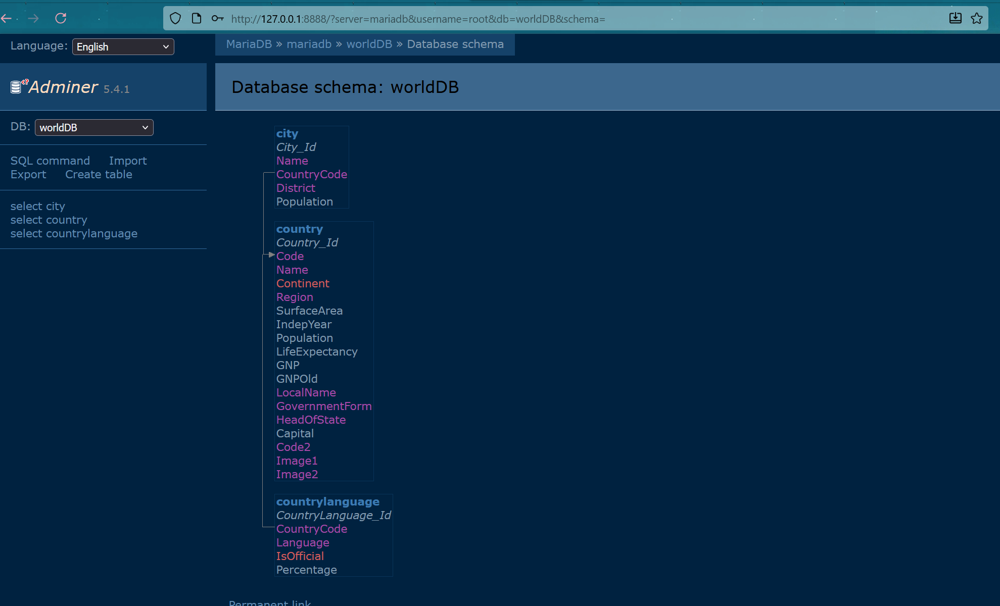

# Linux TD3 – Docker
```bash
ip vm : 172.18.90.126
login : user
passw : User@dmin!
```
# 2 . Origines de conteneurs

### a) Qu’est-ce qu’une « jails » ?
Une jail est une fonctionnalité permettant de créer des environnements isolés. 
### b) Dans quels cadres utilise-t-on les « jails » ?
On les utilises pour isolé et sécuriser des services.
Ou bien créer des environnements de développement
### c) Quel est l’équivalent des « jails » sous Linux ?
L'équivalent sous linux : 
- chroot
- CGROUP

### d) Qu’est-ce qu’un CGROUP sous Linux ?
C'est une fonctionnalité permettant d elimiter et mesurer l'utilisations des ressources.
Permet de limiter des conteneurs (conteneurs A = 2 GO de RAM)


# 3 . Les conteneurs

### a) Quel est le principe de la conteneurisation ?
Le principe est d'isoler une application et toutes ses dépendances.
### b) Quel est la différence essentielle entre un conteneur et une VM ? 
- La VM virtualise le matériel physique, avec l'OS qui tourne et rend lent a démarrer
- Le conteneur virtualise l'OS, les contenenur partagent le noyaux de l'oS incluant seulement l'application et les dépendances, elles sont plus rapides et légers à démarrer.


### c) Quels sont les différents types de conteneur existant ?
- Conteneur d'application : Docker
- Conteneur de système : LXC 
### d) Réaliser l'insatllation de Docker sur votre VM. Lister les commandes utilisées.
```bash 
sudo dnf install -y dnf-utils # installer les outils

sudo dnf config-manager --add-repo https://download.docker.com/linux/centos/docker-ce.repo # ajout du dépot docker

sudo dnf install -y docker-ce docker-ce-cli containerd.io docker-buildx-plugin docker-compose-plugin #installer les paquets docker

sudo systemctl start docker #demarrer docker
sudo systemctl enable docker

```
### e) Qui peux exécuter docker sur votre machine, expliquez les risques que cela impose ?
L'utilisateur "root" et les utilisateur sudo

### f)  Donner l'autorisation à l'utilisateur user d'utiliser docker ?
```bash
newgrp docker
sudo usermod -aG docker user
```
### g) Donnez les définitions pour les termes suivants :
Image : Un template léger autonomme contenant ce qui est nécessaire pour exécuter une application.

Conteneur : Un instance en cours d'execution d'une Image, il est isolé.

Registre : Une service de stockage et de distribution pour les images Docker.

Dockerfile : Un fichier texte contenant toutes les instrucitons nécessaires pour build une image

Docker Compose :  Un outil permettant de définir et d'executer des application docjer multi contenenurs

Docker Hub : Le registre public par défaut géré par docker.
### h)Donnez deux commandes différentes permettant de lister les images ?
```bash
docker images

```

### i) Que permettent dobtenir les commandes suivantes :

docker info : Affiche des info détaillé de l'environnement
docker ps : afficher les contenneurs en cours d'exécution
docker ps -a : affiche tous les conteneurs
docker image : affiche toutes les images téléchargées et construites


# 4. Création d'un conteneneur Docker

###  a) Récupérer l'image Almalinux en version 9.4 minimal depuis un registry (docker hub ou autre ). Quelle commande avez-vous utiliser ?
```bash
docker pull almalinux:9.4-minimal
```

### b) Quelle commande vous permet de lister les images docker en local ?
```bash
docker images
```

### c) Créer un conteneur à partir de l'image Almalinux en version 9.4 minimal. Quelle commande avez-vous utiliser ?
```bash
docker run almalinux:9.4-minimal
```
### d) Arrêter le conteneur que vous venez de créer. Lancé le à nouveau mais en mode interactif. Quelle commande avez-vous utiliser ?
```bash
docker stop 
docker run -it --name my_almashell almalinux:9.4-minimal 
```
### e) La commande docker run permet de créer un conteneur. Quels sont les options que vous avez utilisé pour créer le conteneur ?
```bash

docker run -it 

```

### e) Créer deux conteneurs avec les caractéristiques suivantes, Quelles commandes avez vous utiliser :
```bash
#contenenur 1
docker run -it --name conteneur1 almalinux:9.4-minimal-20240923 

#conteneur 2 
docker run -d --name conteneur2 almalinux:9.4-minimal-20240923
```

### f)  Supprimez le conteneur que vous venez de créer. Quelle commande avez-vous utiliser ?
```bash
docker rm conteneur1
docker rm -f conteneur2
```

### g) Lancez un nouveau conteneur httpd avec la commande suivante :
```bash
docker log web
 ```
### h) A quoi correspond le périphérique docker0 lorsque vous fait un ip addr sur votre VM ?

c'est un router virtuel 
### i) Quelle commande permet de lancer un conteneur et de le détruire une fois qu'il est arrêté ?
```bash
docker run -rm
 ```
### j) Il existe 2 solutions pour créer une nouvelle image d'un conteneur docker. Quelles sont-elles ?
Les deux méthodes : 
    -Dockerfile
    -Docker commit

# 5. Création d'un fichier Dockerfile

### a) A quoi sert la commande FROM dans un Dockerfile ?
FROM sert a définir l'image de base
### b)  A quoi sert la commande COPY dans un Dockerfile ?
COPY sert a copier les ficheier et répertoires depuis votre machine locale
### c) A quoi correspond le répertoire public-html ?
Le repertoir correspond au dossier source sur ma machine local, il contient les ficheirs statiques de site web par exemple
### d) Créer un fichier Dockerfile avec le contenu suivant :
```bash
mkdir dossier-html
nano Dockerfile
nano dossier-html/index.html

```


### e) Créer une image à partir du Dockerfile que vous venez de créer. Quelle commande avez-vous utiliser ?
```bash
docker build -t serveurweb 
```
### f) A quoi sert la commande RUN dans un Dockerfile ?
La commande RUN permet d'executer les commandes nécessaire lors de la construction de l'image

### g) A quoi sert la commande LABEL dans un Dockerfile ?
LAbel permet d'ajouter des métadonnées à l'images


# 6. Versionning d'une image Docker

### a) Quelle commande permet de taguer une image docker ?
```bash
docker tag 
```
### b) Quelle commande permet de pousser une image docker sur un registre docker ?
```bash
docker push
```

### c)  Quelle commande permet de lister les images d'un registre docker ?
```bash
curl -u ICS:123456+Aze http://harbor.pedago.ad.supalta.com/api/v2.0/projects/

```
### d)Taguer votre image webserver avec le tag latest et la pousser sur le registre harbor.pedago.ad.supalta.com ?

### e) Modifier votre site web statique et effectuer une mise à jour de l'ensemble et pousser votre site web sur le registry. Détaillez les étapes ainsi que les commandes ?
```bash
docker build -t serveurweb:v2 .

docker tag serveurweb:v2 harbor.pedago.ad.supalta.com/3ics/bertagna/serveurweb:v2

docker push harbor.pedago.ad.supalta.com/3ics/bertagna/serveurweb:v2*
```


# 7. Création d'une stack Apache / Php FPM/ MySQL

### a)  Quel est le role de la commande build
Le role de la command ebuild lit le fichier docker-compose.yml et Dockerfile
### b)Quel est le role de la commande up? Pourquoi utilise-t-on l'option -d ?
La commande UP permet de demarrer les conteneur du fichier docker-compose.yml
### c)Quel est le role de la commande down? Pourquoi utilise-t-on l'option --volume?
la commande DOWN permet d'arreter et supprimer les coneteneur
### d)Lancez la stack avec la commande docker compose up -d. Qu'observez vous au premier lancement ?
J'observe que docker compile sur la vm 
### e)Utilisez la commande docker compose ps. Qu'observez vous ?

### f)Dans la colonne PORTS que signifie la ligne 9000/tcp? Que signifie la ligne 0.0.0.0:8080->80/tcp
La ligne 9000/ est le port exposé à l'intérieur du réseau docker.
0.0.0.0:8080->80/tcp est un redirection de port

### g) La colonne NAMES contient le nom des différents conteneurs. Comment est constitué le nom de chacun des conteneurs ?
$$\text{Nom du dossier de la stack} + \text{'_'} + \text{Nom du service} + \text{'_'} + \text{Numéro d'instance}$$
### h)Pourquoi utilise-t-on la directive build pour les services php-fpm et apache-httpd au lieu de l'image de base ?
Pour ajouter des fichier de configuration spécifique 
### i)À quoi servent les volumes montés dans chaque service ? Que ce passerait-il en absence de cette directive ? Quelle autre solution serait utilisable a la place du montage de volume ? Détaillez votre réponse pour le conteneur apache-httpd et mariadb uniquement.
Les volumes montés assurent la persistance des données et la synchronisation du code source.
|nom  | ROle du volume | Autre solution |
| ----| ---------------|---------------|
|httpd|Reference le dossier de code|commande copy dans le dockerfile|
|mariadb|Assurer la persistance des données| utiliser un volume nommé géré par docker|


### j) Pourquoi le service apache-httpd dépend-il de php-fpm et mariadb ?
php-fpm : Car il transmet les requetes de fichier php à 9000/tcp car il ne peut pas traiter lui meme 

mariadb : l'application php ne peut pas fonctionner sans base de donnée.

### k) Comment pouvez vous vérifier que le conteneur apache-httpd répond correctement et qu'il s'agit bien de votre conteneur ?

### l) Comment configurer apache pour utiliser HTTPS ?
Il faut :
1. Inclure les cerificats
2. Activer le module ssl
3. configurer le Virtual Host
4. Mapper le port

### m)Il existe au moins 3 méthodes pour lister les DB présentes dans le conteneur mariadb. Donnez les 3 méthodes avec la copie des commandes ou des configurations des outils utilisés.
1. docker exec : Exécute directement la commande mariadb à l'inteérieur du conteneur database.
2. Client externe : Utilise un client mariadb sur le port 3306
3. Interface Adminer : lo'util se connecte au service mariadb via le réseau docker et affiche les db dans un interface
### n)Quelles sont les DB présentes et comment ont-elles été crées ?

### o)Quel est le rôle du conteneur adminer. Donnez les paramètres que vous avez fournis a cette application Web pour vous connecter.
Adminer permet d'administrer via une interface les DB.

MDP : 123+aze

### p)À quoi sert le volume ./init:/docker-entrypoint-initdb.d pour mariaDB ?
le volume permet l'initialisation automatique de la BDD  au lancement
### q) Pourquoi expose-t-on le port 33306 pour mariadb ? Quels sont les risques ? Corrigez le fichier pour que le port 33306 ne soit plus exposé et relancez la stack.
On expose le port 33306 pour l'accès à la BDD
commenter la ligne port de mariadb

### r)Comment communiquent les différents conteneurs de la stack. Donnez la commande permettant de voir la configuration réseau de la stack.
```bash 
[user@localhost stack]$ docker network ls
NETWORK ID     NAME            DRIVER    SCOPE
8b20684ba00e   bridge          bridge    local
ebf24f4da0fa   host            host      local
c0eced742cda   none            null      local
75effdecef99   stack_default   bridge    local
[user@localhost stack]$ docker network ls
NETWORK ID     NAME            DRIVER    SCOPE
8b20684ba00e   bridge          bridge    local
ebf24f4da0fa   host            host      local
c0eced742cda   none            null      local
75effdecef99   stack_default   bridge    local
[user@localhost stack]$ docker network inspect host
[
    {
        "Name": "host",
        "Id": "ebf24f4da0fae47e06d86d56d2c764963ed9a8ff848f19cb59a418490c003c01",
        "Created": "2025-10-20T06:24:32.191586925Z",
        "Scope": "local",
        "Driver": "host",
        "EnableIPv4": true,
        "EnableIPv6": false,
        "IPAM": {
            "Driver": "default",
            "Options": null,
            "Config": null
        },
        "Internal": false,
        "Attachable": false,
        "Ingress": false,
        "ConfigFrom": {
            "Network": ""
        },
        "ConfigOnly": false,
        "Containers": {},
        "Options": {},
        "Labels": {}
    }
]
```
### s)Adaptez le fichier docker-compose et/ou le script PHP pour pouvoir afficher la liste des villes de l'Espagne. Donnez la nouvelle version de vos fichiers et script et une copie d'écran de la liste des villes.
Docker a plante : 
Faire : 
    - docker compose up -d --build
Dans stack/public/index.html
http://localhost:8080/index.php

```php
<?php
<?php
function getCitiesFromCode( String $code) : Array {
    $cnx=new PDO("mysql:host=mariadb;dbname=worldDB", "root", "123+aze");
    $SQL="SELECT * FROM city WHERE CountryCode=:code  ";
    $preparedStatement = $cnx->prepare($SQL) ;
    $preparedStatement->bindValue("code", $code);
    $preparedStatement->execute();
    $cities = [];
    while ( ($city = $preparedStatement->fetch(PDO::FETCH_ASSOC)) != FALSE) {
        $cities[]=$city;
    }
    return $cities;
}


echo "<h1>Liste des villes d'Espagne (ESP)</h1>";
$villes = getCitiesFromCode("ESP");

if (empty($villes)) {
    echo "<p>Aucune ville trouvée. Vérifiez que la table 'city' est bien remplie dans la base de données 'worldDB'.</p>";
} else {
    echo "<ul>";
    foreach ($villes as $ville) {
        echo "<li>" . htmlspecialchars($ville['Name']) . " (" . htmlspecialchars($ville['District']) . ")</li>";
    }
    echo "</ul>";
}
?>


```

### t) Les mots de passe sont en clair dans le fichier docker-compose.yml. Quels sont les risques et comment les atténuer 
Risque : 
    - Toutes les personnes ayant accès aux fichier peuvent voir les mdp
    - En cas de fuite, tout le monde peut voir en claire les mdp

Solutions : 
    - Stocker dans un ficheir séparé (.env)
    - Utiliser docker secrets

### u)  Comment sécuriser l’accès à Adminer et Mongo-Express en production ?

Etablir un tunnel SSH : 
Controler l'accès via un accès reserver à une plage d'IP.

Adminer : 
