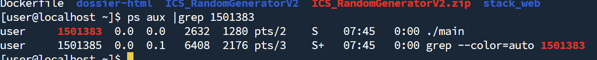
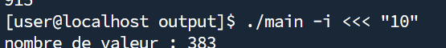
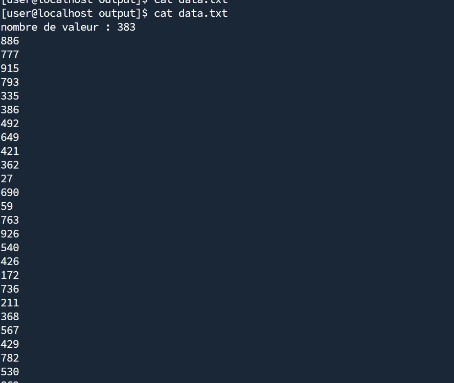
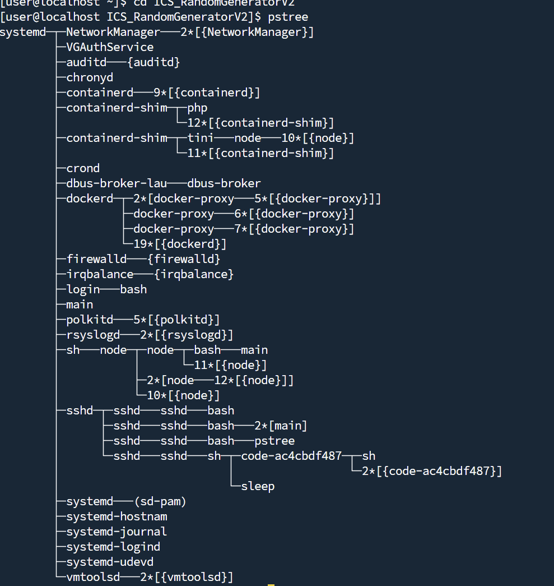
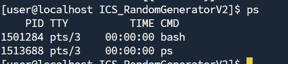
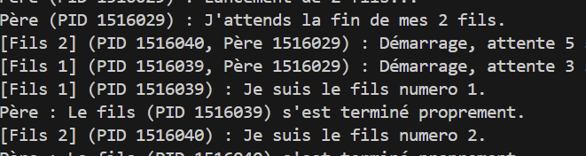
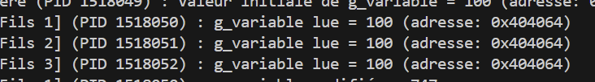
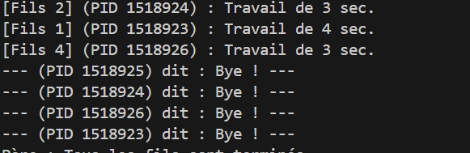

# 5.Commandes de base


### A)  Quel est le rôle des commandes suivantes

    -ps : Affiche des informations sur les processus en cours d'exécution. 
    -pstree : Affiche les processus sous forme d'arbre
    -kill : Permet de terminer un processus 

### B)Tapez la commande ps -aux. Quelle est son utilité ? A quoi correspondent les colonnes :
    -USER : L'utilisateur (propriétaire) qui a lancé le processus.
    -PID : L'identifiant unique du processus (Process ID).
    -%CPU : Le pourcentage du CPU utilisé par le processus.
    -%MEM :Le pourcentage de la mémoire physique (RAM) utilisé par le processus.
    -VSZ :La taille totale de la mémoire virtuelle utilisée par le processus
    -RSS :La part de la mémoire virtuelle qui est actuellement en mémoire physique
    -TTY :Le terminal de contrôle associé au processus
    -STAT :L'état du processus (R,S,D,T,Z)
    -START :L'heure ou la date à laquelle le processus a été démarré.
    -TIME :Le temps CPU total consommé par le processus
    

### C) La commande top ou htop affiche une colonne PR et NI. A quoi correspondent les deux colonnes ? Quelle est la différence entre PR et NI ?
NI est la valeur demandée par l'utilisateur pour influencer la priorité. PR est la priorité résultante utilisée par le système.

### D)Quelle commande permet d’afficher la priorité d’un processus
La commande ```ps``` permet d'afficher la priorité d'un processus.

### E)Quelle commande permet de changer la priorité d’un processus
```nice``` permet de changer la priorité d'un processus.
```renice``` permet de modifier la priorité d'un processus.
### F)Quelle est la différence entre kill -3 et kill -9 ? A quoi correspondent les options -3 et -9 ? Donnez la liste des principaux signaux ( valeur numérique, nom, rôle)
    -kill -3 : quitter le processus signal faible
    -kill -9 : KILL le processus signal fort

```
SIGHUP
SIGINT
SIGTERM
Et d'autres
```
### G)Quelle est la particularité du signal SIGKILL ?
Sa particularité est qu'il ne peut pas être géré par le processus cible.
### H)Quel est le rôle de la commande nohup ?
nohup  permet de lancer une commande qui ignorera le signal
### I)Quelles commandes vous permettent de passer un processus en arrière plan ? De le ramener en avant plan ? De le mettre en pause ?
Au lancement : & (ex: ./mon_programme &)
fg (ramène la dernière tâche mise en arrière-plan)
Ctrl+Z (depuis le terminal où il s'exécute en avant-plan).

# 6.Gestion des processus

### A) Il existe deux approches pour passer le processus en « background » (tache de fond). Lesquelles ?
Au lancement : /randomgenerator & 
Pendant l'execution du prog : 
```
./randomgenerator
[Ctrl+Z]  # Met en pause 
bg # Redémarre en arrière-plan 
```
### B)Votre processus est en tache de fond ? Tapez la commande « clear » ? Qu’observez-vous ?
On observe que la commande clear s'exécute (l'écran est effacé), mais immédiatement après, l'écran est "pollué" par la sortie du processus randomgenerator
### C)Comment pouvez-vous mettre le processus en pause ? Il existe deux approches, lesquelles ?
Depuis l'avant plan  : CRTL + Z
Depuis l'arrièrre plan : kill -19
### D)Que devez-vous faire pour le ramener en « foreground » (avant plan?)
Avec la commande fg pour la ramener devant
### E)Que devez-vous faire pour arrêter le processus. Vous avez deux solutions, lesquelles ?
Solution 1 : Avec CTRL+C 
Solution 2 : Kill -9
### F)Quelle est la différence entre un numéro de tache et un numéro de processus.
Numéro de tache : geré par le terminal , c'est l'identifiant du terminal 
Numéro de processus : geré par le kernel, identifiant unique à l'echelle système
### G)lancer le programme en tache de fond depuis un terminal ssh et déconnectez-vous du terminal. Le processus et il actif ? Comment avez-vous vérifié?

J'ai lancé le programme en arrière plan : ``` ./main & ``` et dans une autre fenetre j'ai vérifié avec &```ps aux | grep <LEPID>```

### H)Comment pouvez-vous lancer un processus qui restera actif même si vous fermez la session ? Il existe au moins deux solutions, lesquelles ?


J'ai lance le programme avec nohup en background: ``` nohup ./main &``` j'ai exit le terminal et sur une autre fenetre j'ai fais &```ps aux | grep <LEPID>```
### I)Comment lancer randomgenerator avec une priorité plus faible ?
```nice -n 10 ./main &```
### J) Quelle commande vous permet de changer la priorité de randomgenerator ?
```renice 15 -p <LEPID>``` 
Permet de modifié la priorité d'un processus.

# 7. Redirection de flux

### a) Que fait la commande randomgenerator > rands.txt ?
Elle redirige l'outpout de randomgenerator dans rands.txt en remplacant le fichier entier

### b)Que fait la commande randomgenerator >> rands.txt ?
Elle redigirige l'outpout de randomgenerat a la fin du fichier rand.txt sans supprimer ce que le fichier contient
### c)Que fait la commande randomgenerator -i ?
Elle lance le programme en demandant le nombre de valeur 
### d)Que fait la commande randomgenerator -i <<< "10"

Elle utilise la premiere valeur en tant que nombre de valeur saisie
### e)Tapez la commande echo "20" > response.txt  Que fait-elle ?
Elle écrit dans response.txt "20"
### f)Que fait la commande randomgenerator -i << response.txt
Elle attend qu'on écrive le nombre de valeur avant d'envoyer dans response.txt

### g)Que fait la commande randomgenerator -i <<< "10" | sort -n ?
Execute la commande randomgenerator et trie les 10 premier
### h)A quoi correspond les flux 0, 1, 2 (stdin, stdout, stderr) ?
    - 0: Ce que le processus lit
    - 1: La ou le processus lit le résultat
    - 2: La ou le processus ecrit les erreurs

### i)Que fait la commande randomgenerator -i <<< "50" > data.txt &
    -Execute le programme et donne 50 en input
    -redirige la sortie  vers data.txt
    -et tout ca en background
### j)Vous devez maintenant avoir un fichier nommé data.txt, que fait la commande cat data.txt | sort -n

on voit ici que l'output de la commande est redirigé dans le txt, il a fallut attendre 25 secondes que tout se mette dans le fichier car il y a 25 valeurs
### k)Modifier le code source de RandomGenerator pour qu'il accepte l'option -n XXX, XXX étant le nombre de valeurs aléatoires désirées, et donnez le code.
Remplacer -ia par -in pour ajouter l'option input :

Rajoute d'un case pour convertir le input XXX en nombre : 


Code final : 
```c
/*
 * To change this license header, choose License Headers in Project Properties.
 * To change this template file, choose Tools | Templates
 * and open the template in the editor.
 */

/* 
 * File:   main.c
 * Author: aurelio
 *
 */

#include <stdio.h>
#include <stdlib.h>
#include <unistd.h>
#include <time.h>

/*
 * 
 */
int main(int argc, char** argv) {
    char oc;
    int repet = -1;

    while ((oc = getopt(argc, argv, "in")) != -1) {
        switch (oc) {
            case 'a':
                printf("boummm \n");
                break;
            case 'i':
                printf("nombre de valeur : ");
                scanf("%i", &repet);
                break;
            case 'n':
                repet = atoi(optarg); //convertir en nombr en XXX (le role de atoi)
                break;
            case '?':
            default:
                break;
        }
    }

    while (repet-- != 0 ) {
        printf("%d\n", rand()%1000);
        usleep(500000);
    }
    return (EXIT_SUCCESS);
}

```
# 8. Création d'un processus en C

### a)Quel intérêt a un processus de se 'forké' ? Dans quel TD précédent un processus est-il « forké » ? Pour qu'elles raisons ?
L'intérêt principal pour un processus de se "forker" (se cloner) est d'exécuter des tâches en parallèle. Dans le TD Docker.
### b) Quelles sont les particularités d'un processus « forké »
Le processus forké est un clone presque parfait :
    Certaines choses changent : 
        - Le PID
        - Une mémoire séparée 
Il hérite de son clone père 
le fork() renvoie 0 si il est fils et si il est père renvoie un nombre > a 0
### c) Quelle différence existe il entre un processus « forké » et un thread ?
La principale différence est la gestion de mémoire.
### d)Quelle est l'une des limites de l'utilisation de fork() ?
La compléxité de communication, il doivent communiquer grâce a des IPC : Communication Inter-processus qui sont lourds
### e) Quels problèmes peuvent poser les threads ?
Si deux threads modifie la même variable, le résultat sera imprévisible.
Il faudrait donc vérouiller les ressoruces a chaque passage d'un thread afin que deux threads ne puissent modifier la meme variable

# 9. Utilisation de fork, wait, waitpid, sleep

### a)Que donnent les commandes ps et pstree pendant l’exécution du programme ?
pstree : 


ps :

### b)Observez l’état des processus.Que se passe-t-il ? Corriger le code du processus père pour que les processus se terminent correctement.
Je rajoute +1 a i pour dire que le fils est le numéro i+1 

Recuperation du PID pere pour que le fils puisse l'identifier avec ```getpid()```


### c)Modifiez le code précédent pour que les fils affichent "Je suis le fils numero n ". La valeur de n est le numéro d'ordre de création du fils. Le fils doit aussi affiché sont PID, ainsi que le PID du père.

J'ai fais un affichage plus lisible dans les printf
J'ai lancé deux fils et on voit ici que l'ordre de création est FILS 2 puis FILS 1, fils 1 commence par dire je suis fils 1 etc.. 'voir capture'
### d)Modifiez le programme précédent pour qu'il y ait toujours le même nombre d'enfants en fonction.
après le fork on wait() 
on lance le pool initial, 
dès qu'un fils est terminé, le père en fork un nouveau
### e) Créez une variable globale. Chaque fils devra afficher la variable globale avant de la modifier de façon aléatoire et afficher la nouvelle valeur, juste avant de terminer son activité. Qu'observez-vous ? Est-ce cohérent avec les questions de la partie 6 ?


On observe que : 
tous les fils voient la meme adresse mémoire, tous les fils voient la valeur initiale, ils modifient la variable en valeur différente et à la fin le père à bien la variable initiale.

# 10. Exécution de routine de terminaison

### a) Modifiez le programme précédent pour que les processus affichent "Bye" en utilisant une fonction de terminaison.


Les fils disent "bye" lorsqu'ils utilise une fonction de terminaison. Explication : 
Créer une fonction "dire_aurevoir()"
Permettant de dire bye et afficher le PID.
Appelé cette fonction à chaque exit dans la boucle 
On initialise l'appelle de la fonction en haut du main atexit(dire_aurevoir)

# 11. Execution du programme externe avec exec

### a) Modifiez le programme précédent pour que chaque processus fils lance l’exécution du programme randomgenerator avec un nombre de valeur comprise entre 10 et 20. (i.e. randomgenerator -n 15 )
```c

#include <stdio.h>
#include <stdlib.h>
#include <unistd.h> 
#include <sys/wait.h>
#include <time.h>

int main(int argc, char** argv) {
    int n;
    printf("Combien de fils lanceurs (max 9) ? ");
    scanf("%d", &n);
    if (n <= 0 || n >= 10) return 1;
    
    // Initialiser le générateur de nombres aléatoires pour le père
    srand(time(NULL)); 

    printf("Père (PID %d) : Lancement de %d fils...\n", getpid(), n);

    for (int i = 0; i < n; i++) {
        pid_t pid = fork();

        if (pid < 0) {
            perror("fork"); exit(1);
        } else if (pid == 0) {
            // Code du FILS

            int n_val = (rand() % 11) + 10; //Générer un nombre aléatoire entre 10 et 20
            
            // convertir ce nombre en chaîne de caractères
            char n_str[4]; // Assez pour "20" + NUL
            sprintf(n_str, "%d", n_val);
            
            printf("[Fils %d] (PID %d) : Je lance './main -n %s'\n", 
                   i+1, getpid(), n_str);
            
            // rempalcer ce processus fils par le programme "./main"
            execlp("./main", "main", "-n", n_str, NULL); //On lui passe "-n" et le nombre (n_str) comme arguments
            
            // si execlp() marche , le code s'arrête
            // sinon, 'il y a eu une erreur.
            perror("execlp a échoué");
            exit(1); 
        }
    }

    // --- Code du PÈRE ---
    // le pere  attend que ses 'n' enfants se terminent
    printf("Père (PID %d) : J'attends que les %d fils aient terminé.\n", getpid(), n);
    
    for (int i = 0; i < n; i++) {
        wait(NULL); 
    }
    
    printf("Père : Tous les './main' sont terminés.\n");
    return 0;
}
```

