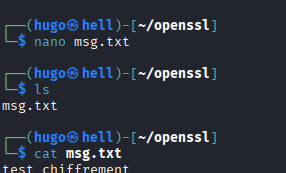
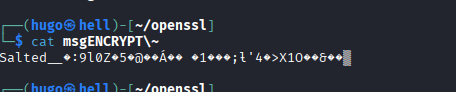

# OpenSSL 

!!! info "C'est quoi OPENSSL ?"
    **OpenSSL**  est une boîte à outils de cryptographie qui implémente les protocoles SSL (Secure Sockets Layer) et TLS (Transport Layer Security). Elle permet d'effectuer des tâches liées à la sécurité comme la création de certificats numériques, la gestion de clés privées, le chiffrement et le dé-chiffrement de données, et les tests de connexions sécurisée


---
|**Utilitaires OpenSSL**|**Description**|**Exemples d'Extensions de Fichiers**|
|---|---|---|
|**`genrsa`**|Génère une **clé privée** RSA. C'est souvent la première étape.|`.key`, `.pem`|
|**`req`**|Crée une **demande de signature de certificat (CSR)** et peut générer des certificats auto-signés.|`.csr`, `.pem`|
|**`x509`**|Gère les **certificats X.509** (les certificats SSL/TLS). Permet de visualiser, convertir, ou modifier un certificat.|`.crt`, `.cer`, `.pem`, `.der`|
|**`rsa`**|Gère les clés RSA : permet de visualiser une clé ou de la déchiffrer.|`.key`, `.pem`|
|**`pkcs12`**|Permet de manipuler des fichiers **PKCS#12** (ou `.pfx`/`.p12`), qui stockent une clé privée _et_ son certificat dans un seul fichier protégé par mot de passe.|`.pfx`, `.p12`|
|**`s_client`**|Agit comme un client SSL/TLS pour **tester une connexion** à un serveur distant et inspecter sa chaîne de certificats.|N/A|
|**`ciphers`**|Liste les **suites de chiffrement** supportées par OpenSSL.|N/A|
|**`dgst`**|Calcule des **hachages** (digests) de fichiers en utilisant divers algorithmes (ex: SHA256).|N/A|

---

## Commandes clés : 

|**Tâche**|**Commande OpenSSL**|
|---|---|
|**Générer une Clé Privée RSA (2048 bits)**|`openssl genrsa -out ma_cle_privee.key 2048`|
|**Créer une Demande de Signature de Certificat (CSR)**|`openssl req -new -key ma_cle_privee.key -out ma_demande.csr`|
|**Auto-signer un Certificat (pour le développement)**|`openssl req -x509 -days 365 -key ma_cle_privee.key -in ma_demande.csr -out mon_certificat.crt`|
|**Vérifier le Contenu d'un Certificat**|`openssl x509 -in mon_certificat.crt -text -noout`|
|**Tester la Connexion SSL d'un Site Web**|`openssl s_client -connect google.com:443`|


## Exemple :

On va chiffrer un msg dans msg.txt :  



On va executer la commande : ```openssl enc -e -aes-128-cbc -in msg.txt -out msgENCRYPT ```  

- *enc* : methode openssl permetannt de chiffrer / dechiffrer

- *-e* : singification "encrypt"

- *-aes-128-cbc* : Algorithme de chiffrement ( ca pourrait en être un autre).

- *-in msg.txt* : fichier à chiffrer 

- *-out msgENCRYPT* : le fichier précedent en chfifrer.


On a donc le nouveau fichier msgENCRYPT on va l'afficher pour montrer qu'il est chiffré : 




*Maintenant on va déchiffrer pour retrouver le message précedent*

Commande : ```openssl enc -d -aes-128-cbc -in msgENCRYPT -out msgDECRYPT```

- *enc* : methode openssl permetannt de chiffrer / dechiffrer

- *-d* : singification "decrypt"

- *-aes-128-cbc* : Algorithme de chiffrement ( ca pourrait en être un autre).

- *-in msgENCRYPT* : fichier à dechiffrer

- *-out msgDECRYPT* : le fichier déchiffrer. 


Et voilà maintenant on peut chiffrer un fichier avec un algorithme de chiffrement simple "aes128". 

# A CONTINUER

