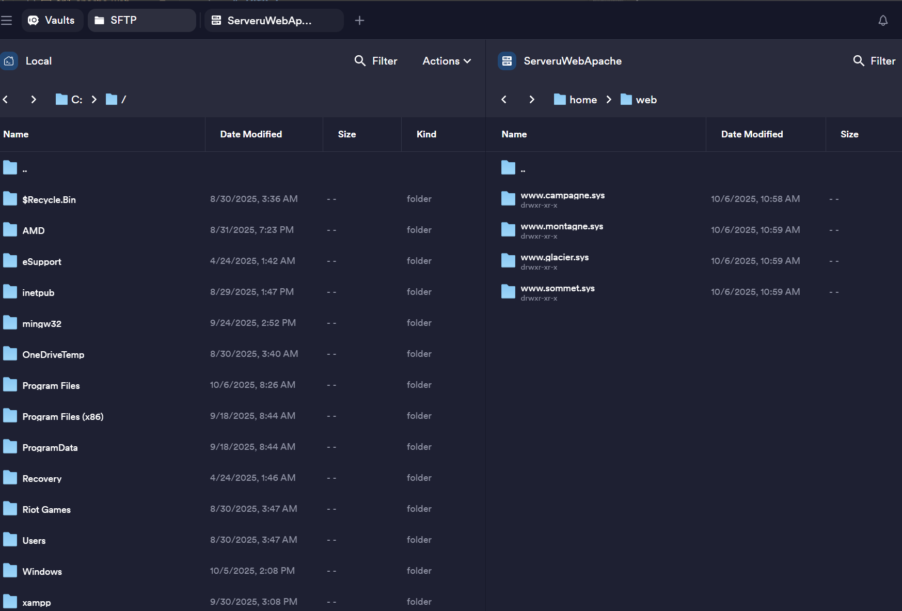
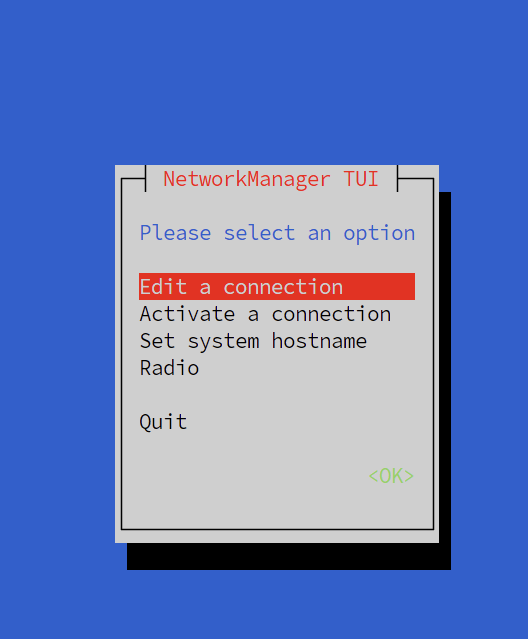
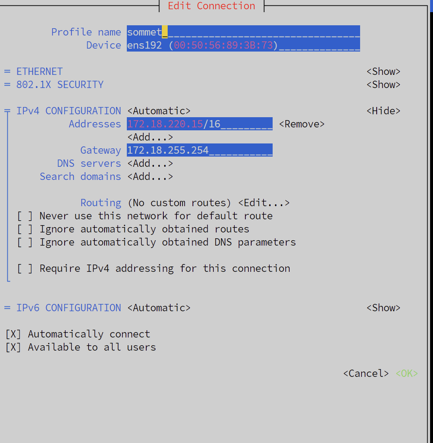
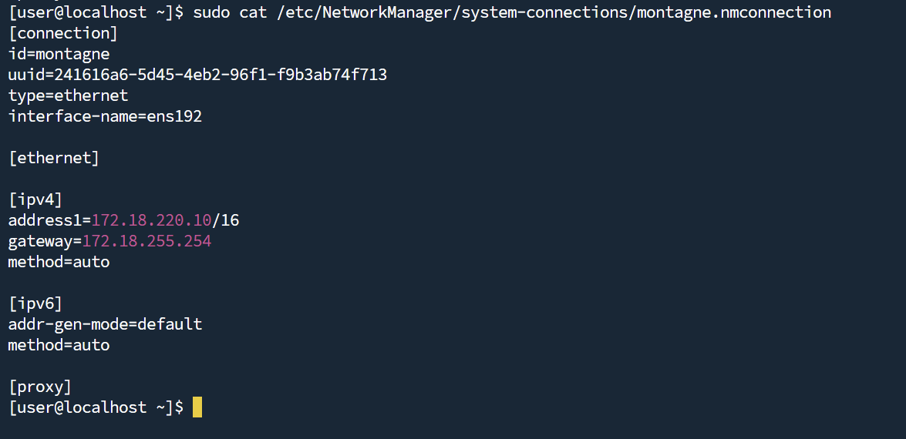
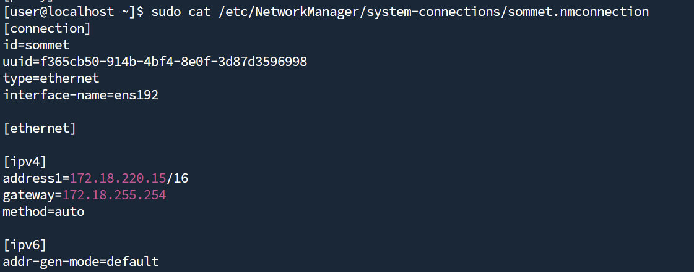
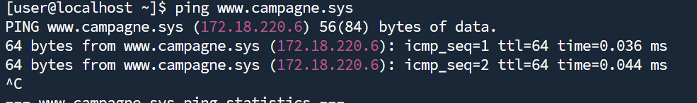
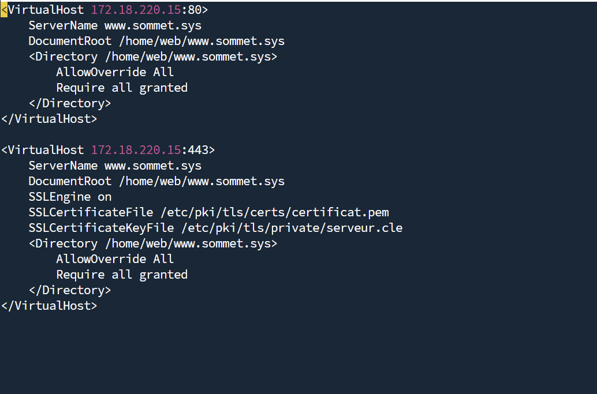
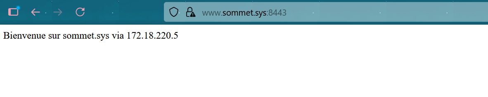
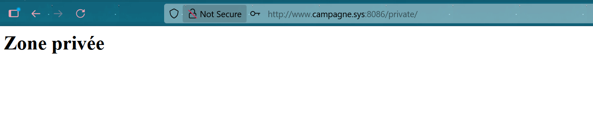

# Info : 
    -Login : user
    -mdp : User@dmin!
http://localhost:8181/ = campagne

## 2 - **Désactivation de SELinux**

### a) A quoi sert ce composant ?

SELinux est un module de sécurité du noyau qui applique un contrôle d'accès obligatoire.
C'est une couche de protection supplémentaire contre les attaques et erreur de configuration.

### b) Comment peut-on le désactiver momentanément ?
1) La première façon est : 
```
setenforce 0
```
Cela permet de mettre SELinux en mode permissif (log mais ne bloque plus).
2) La seconde façon est de modifier la variable de boot du noyau, cela va désactiver SELinux pour le démarrage suivant uniquement.
```
selinux=0
```
### c) Comment peut-on le désactiver de façon permanente ?

Pour le modifier de façon permanente, il faut : 

```
sudo vi /etc/selinux/confi
```

Et remplacer la ligne ```SELINUX=enforcing```
Par : 
``` SELINUX=disabled```


## 3- **Désactivation momentané du pare-feu.**

### a) Quelle commande vous permet de désactiver temporairement le firewall, le temps de procéder a la configuration de la machine ?

Pour désactiver temporairement le firewall : 
```
sudo systemctl stop firewalld
```


### b) Quelle commande vous permet d’avoir la certitude que le firewall est bien inactif ?

Pour vérifier si le firewall est stop : 
```
sudo firewall-cmd --state
```

## 4-Installation du service Apache (La configuration réseau avancé viendra par la suite)

### a) Quels sont les trois principaux serveurs WEB disponible sous Linux

Les trois principaux sont : 
    -Apache
    -Nginx
    -Lighttpd

### b)La commande dnf (ou anciennement yum) permet d’installer les packages.
Quelle commande permet de retrouver le nom du package contenant le serveur Apache ?
    - La commande est : ``` dnf search apache```
Quelle commande permet d’installer le serveur Apache ?
    - ``` sudo dnf install httpd```

### c) Démarrage du service Apache
La commande permettant de démarrer le service Apache est :
``` 
sudo systemctl start httpd
```


### d) Quelle commande vous permet d’avoir la certitude que le service Apache est fonctionnel ?

La commande permettant de vérifier si apache est fonctionnel :
```
sudo systemctl status httpd
```

### e) Quelles informations essentielles vous sont fournies par cette commande ?
    -L'état du servce (loaded)
    -Activité : active ou inactive
    -Docs man:httpd.service(8)

## 5- Configuration du service Apache

### a) Ou se trouvent les fichiers de configuration de Apache ?
Les fichiers de configurations d'Apache sont dans :*
```
/etc/httpd
```
### b) Quelle est la structure de ce répertoire ?

### c) Ou se trouve le fichier de configuration principal ?
Le fichier de configuration principal se trouve :
```
/etc/httpd/conf/httpd.conf
```
### d) Que contient (du point de vue logique) le répertoire conf.d
Le repertoire conf.d contient des fichier de configuration supplémentaire tel que la configuration d'un virtualhost : 
[référence](https://www.debian-fr.org/t/apache2-fichiers-de-config/71907/3)
### e)Que contient le répertoire conf.modules.d
Le repertoire conf.modules.d contient : 

### f) Qu’est-ce qu’un module ?
Un module est une extension qui ajoute des fonctionnalités à Apache.
### g) Ou sont-ils stockés ?
Ils sont stockés dans : 
```
/usr/lib64/httpd/modules/
```

### h) Ou sont stockés les log de Apache ?
Les logs par défauts sont stockés dans : 
```
/var/log/httpd/
```

## 6- Exploration de la configuration de base (fichier httpd.conf)

### a) Qu’est ce que le ‘DOCUMENT ROOT’ ?
Le Document Root est le répertoire racine du serveur web
### b) Sur quel répertoire pointe-t-il ?
Il point sur :
```
/var/www/html
```
## c) A quoi sert la directive ‘Listen’
La directive 'Listen' permet de savoir sur quel port et IP le serveur web doit écouter les requêtes.
## d) A quoi sert la déclaration <Directory >
La déclaration <Directory> permet de définir les règles de configurations pour un repertoire.
## e) A quoi servent les directives ‘AllowOverride’ et ‘Require’ ?
1. AllowOverride
    - [Définit si Apache autorise les fichiers .htacces dans le repertoire à surcharger certaines directives.](https://www.yvonh.com/apache-la-directive-allowoverride/) 
2. Require 
    - Le ficheir require permet de définir qui peux accéder aux fichiers du répertoire.
## f) A quoi sert le fichier welcome.conf ?
Le fichier ```welcome.conf``` permet d'afficher la page d'accueil d'Apache. 
## g) A quoi sert la commande apachectl ?
La commande apachectl est un outil de contrôle du serveur Apache.


## 7 - Tests et Installations complémentaires

## a) Exécutez la commande yum install php -y , Quels packages sont installés ?

## b)Le service Apache utilise désormais systématiquement le package ‘php-fpm’ contenant les éléments nécessaires pour l’exécution de pages web dynamiques. Que contient ce package ?
Le package php-fpm contient :
    -les binaires php.
    -la gestion des processus pour le serveur web
    -les ficheir de configuration php

## c) Comment prouver que le serveur Web est désormais capable d’exécuter du PHP ?
Pour prouver que le serveur web est capable d'exécuter du PHP, il suffit de crée un fichier ```info.php``` dans le repertoire ```/var/www/html/info.php```

et y mettre  : 
```
<?php
phpinfo()
?>
```

## d) Quelle version de php est installée ?
La version de php est :

## e)Comment connaître la configuration complète du serveur web (librairies installées, avec leurs versions et configurations?)
On peut soit regarder sur le info.php que j'ai crée sur l'adresse : http://localhost:8080/info.php
Ou alors :
via les commandes :
```
php -m #liste les modules
php -v #version de php
php -i #info détaillés (ressemble à phpinfo())

httpd -M #module Apache
```
## f)  Installez les packages et donnez le rôle des packages suivants :

    -php-gd
    ```sudo dnf install php-gd -y```
    Permet à php de manipuler des images

    -php-mysqlnd
    ``` sudo dnf install php-mysqlnd -y ```
    Permet à php de se connecter aux BDD Mysql

    -php-pdo
    ``` sudo dnf install php-pdo -y ```
    Permet de se connecter à plusieurs de types de BDD

    -php-mbstring
    ``` sudo dnf install php-mbstring -y ```
    Permet de gérer les chaines de caractères UTF8


## 8- Configuration avancée

### a)Installez le service vsftp, et bien sûr, vérifiez qu’il est opérationnel. Qu’avez-vous fait comme commande ?

Il faut installer vsftpd : ``` sudo dnf install vsftpd -y ```

Demarrer le service et l'activer : 
```
sudo systemctl start vsftpd
sudo systemctl enable vsftpd

```
### b) Créez un compte utilisateur nommé ‘web’. Le répertoire de travail de l’utilisateur ‘web’ contiendra les dossiers hébergeant les différents sites web gérés par l’utilisateur ‘web’ :

Je vais crée l'user 'web' avec son sheel par défaut : 
```
sudo useradd -m -s /bin/bash web
```

### - un dossier www.campagne.sys pour l’instance httpd virtuel qui répondra aux requêtes sur une IP (serveur virtuel par IP, cf virtualhost)

### - un dossier www.montagne.sys et www.glacier.sys pour l’instance httpd virtuel qui répondra aux requêtes les deux domaines (Hébergement mutualisé, cf web multi-homing )

### - un dossier www.sommet.sys pour tester la mise en place d’un serveur répondant aux requêtes https.

### - Donnez la liste des commandes utilisées.

Les quatres dossiers : 
```
 sudo mkdir /home/web/www.campagne.sys
sudo mkdir /home/web/www.montagne.sys
sudo mkdir /home/web/www.glacier.sys
sudo mkdir /home/web/www.sommet.sys


Puis Changer le propriétaire : 

sudo chown -R web:web /home/web/


Puis définir les permissions :

sudo chmod -R 755 /home/web/

```

### c) Vérifiez que vous pouvez accéder en lecture/écriture a tous les répertoires présents dans le répertoire /home/web en utilisant un client ftp comme FileZilla. Donnez les permissions de /home/web ainsi que celles des dossiers précédemment créés



## 9 -  Configuration réseau :

### a) Configurer votre carte réseau avec l’IP fixe 172.18.xx.5/16 en utilisant nmtui et donnez le contenu du fichier /etc/NetworkManager/system-connections/ens192.nmconnection (ens192 correspond au nom de la carte réseau, elle peut changer selon le contexte de déploiement de la VM)

Je vais détailler étape par étape : 
Lancer l'outil nmtui :
```sudo nmtui```
nmtui = Text User Interface for NetworkManager


1. Selectionner Edit a connection 
2. Choisir carte réseau
3. 
Je peux ping 172.18.220.6 et www.sommet.sys

### b)A quoi sert la commande nmcli

La commande ```nmcli``` est l'interface en ligne de commande NetworkManager
    - Elle permet de crée modifier supprimer des connexions réseaux
    - Afficher l'état des interfaces
    - Configurer des Ip statiques et dynamiques 
### c) A quoi sert la commande nmcli

Le service NetworkManager est un service système qui gère les connexions réseau sur Linux.
    -La détection automatique des interfaces
    -La configuration Ip 
    -La gestion de DNS
### d) A quoi sert le fichier /etc/resolv.conf ?

Ce fichier contient les serveurs DNS 

### e) Que devez-vous faire comme tests pour vérifier la connectivité de votre VM ?
```
ping 172.18.255.254
ping 8.8.8.8

curl http://www.free.fr

```
### f)  Votre machine peut-elle joindre www.free.fr ? Quelle commande avez vous utilisez pour le vérifier ?
Oui  : 


### g)  Votre VM peut-elle être jointe par l’un de vos collègues ? Si non, pourquoi ? Quels tests avez-vous effectués ?

Je ne sais pas je n'ai pas pu tester.


## 10 - IP Virtuelles pour les serveurs virtuels par Ip et No (multi-homing)
Pour www.campagne.sys : IP = 172.18.220.6:8086 
http://www.campagne.sys:8086


Pour www.sommet.sys : IP = 172.18.220.15:8087
http://www.sommet.sys:8087


Pour www.montagne.sys : IP = 172.18.220.10:8081
http://www.montagne.sys:8081


Pour www.glacier.sys : IP = 172.18.220.10:8081
http://www.glacier.sys:8081

### a) Ajouter trois adresses IP virtuelles en utilisant nmtu
### 172.18.xx.6/16 permettant de contacter le site web www.campagne.sys

### 172.18.xx.10/16 permettant de joindre www.montagne.sys et www.glacier.sys

### 172.18.xx.15/16 permettant de joindre www.sommet.sys

### Donnez le contenu des 3 fichiers de configuration :
Config 1 : campagne (/etc/NetworkManager/system-connections/campagne.nmconnection)


Config 2 : montagne (/etc/NetworkManager/system-connections/montagne.nmconnection)


Config 3 : sommet (/etc/NetworkManager/system-connections/sommet.nmconnection)


### b) Comment prouver que votre configuration est fonctionnelle ?



## 11 - Configuration du premier serveur virtuel : serveur virtuel par IP

### a)Créez le premier serveur web virtuel. La racine (DocumentRoot) de ce serveur web sera bien sûr le répertoire www.campagne.sys. Donnez le nom et le contenu du fichier de configuration.
Voici le virtual host : 
```
/etc/httpd/conf.d/campagne.conf
<VirtualHost 172.18.220.6:80>
    ServerName www.campagne.sys
    DocumentRoot /home/web/www.campagne.sys

    <Directory /home/web/www.campagne.sys>
        Options Indexes FollowSymLinks
        AllowOverride None
        Require all granted
    </Directory>

    ErrorLog /var/log/httpd/campagne_error.log
    CustomLog /var/log/httpd/campagne_access.log combined
</VirtualHost>

```
### b)Prouvez que votre serveur virtuel est a l’écoute et joignable depuis une machine présente sur le réseau LaboVM. Quelle est votre démarche ?
Dans un premier temps, il faut regarder le status de httpd 

On le voit "active"

Puis regarder si le port 80 est ouvert sur 172.18.220.6 : 

On le voit sur "*".


# RAJOUT Important !!! 
J'ai eu un problème j'ai donc rajouté un tunnel : 

Sur le port 81 j'ai mis campagne

Dans son virtual host : ``` /etc/httpd/conf.d/campagne.conf```
Et dans la conf httpd : 

Dans le fichier ```/etc/httpd/conf/httpd.conf```

Mais je ne sais pas si c'est bon.
### c) Testez votre configuration en utilisant votre navigateur (depuis votre Windows ou depuis une autre VM). Pouvez-vous prouver que c’est bien le serveur virtuel que vous venez de configurer qui a répondu ? Comment ?
Voici la page campagne : 


Pour prouver il y a le texte simplement qui est différents de celui du port 8080.
### d) Votre serveur vous a retourné un message « access denied » ? C’est probablement normal, pourtant vous avez prouvé qu’il était a l’écoute :
    -Le "Allow" permet de controler qui peut acceder au repertoire
    -Les permissions sont : 
    - Il faut mettre cela en directive Apache en guise de solution propre :
```
<Directory /home/web/www.campagne.sys>
    Require all granted
</Directory>
```
### e) Déployez l’application web phpsysinfo (http://phpsysinfo.github.io/phpsysinfo/) dans le répertoire www.campagne.sys et fournissez une copie d’écran de la page d’accueil de cette application.
Voici l'application web phpsysinfo sur l'address http://localhost:8181


### ebis) Testez l’URL http://172.18.xx.5 Avez vous obtenu une réponse ? Si Oui pourquoi ?
Je n'obtiens rien sur http://172.18.220.5/
J'ai crée un port 8085 pour loger la page. 


## 12 - Serveur virtuel par nom 

### a) Créer les deux serveurs web virtuels répondant pour le domaine www.montagne.sys et www.glacier.sys sur l’IP 172.18.xx.10 et donnez le contenu du/des fichier·s de configuration.
Dans le fichier de conf : ```/etc/httpd/conf.d/montagne_glacier.conf```

J'ai mis : 

```
<VirtualHost 172.18.220.10:80>
    ServerName www.montagne.sys
    DocumentRoot /home/web/www.montagne.sys

    <Directory /home/web/www.montagne.sys>
        Require all granted
    </Directory>
</VirtualHost>

<VirtualHost 172.18.220.10:80>
    ServerName www.glacier.sys
    DocumentRoot /home/web/www.glacier.sys

    <Directory /home/web/www.glacier.sys>
        Require all granted
    </Directory>
</VirtualHost>

```
### b) Avez vous vu la note concernant la configuration des DNS ? Donnez-en un résumé
La documentation indique que pour que les serveurs virtuels par nom fonctionnent :

    - Le client doit envoyer le nom de domaine dans l’en-tête HTTP (Host:)

    - Cela nécessite que le nom de domaine soit résolu (via DNS ou fichier hosts)

    Sinon, Apache ne peut pas savoir quel vhost servir
### c) Mettez en place une solution permettant de garantir que le serveur virtuel hébergeant www.montagne.sys est bien le bon a répondre et procédez aux tests. Justifiez votre démarche.
C'est bien www.montagne.sys qui répond : 

et le fichier de conf : 


Sur le tunnel j'ai fais en sorte que l'IP de montagne soit relié au port 8081 donc le lien sera http://www.montagne.sys:8081
J'ai aussi modifié mon /etc/hosts pour mettre www.montagne.sys reconnu.

### d) Testez l’URL http://172.18.xx.5 . Quel serveur virtuel a répondu ? Est-ce le comportement attendu ? Justifiez votre réponse.
Le serveur qui a répondu est le premier VirtualHost défini dans la configuration Apache sur l’IP 172.18.220.5
Car apache utilise le premier défini si il n'y aucune autre justification
### e) Avez vous vu la note intitulée « Le serveur principal disparaît » ? Quelle information essentielle contient-elle ?
Cette note indique qu’une fois des VirtualHosts configurés, Apache ne sert plus automatiquement le serveur principal. Il faut définir un VirtualHost par défaut si l’on souhaite qu’il réponde en l’absence de correspondance explicite.

## 13 - Serveur virtuel, HTTPS et SSL

### a)  Avez vous vérifié que le module nécessaire a l’utilisation du HTTPS était installé et chargé ? Quel est le nom du module ? qu’avez vous fait pour vérifier qu’il était chargé en mémoire par Apache ?
```
sudo dnf install mod_ssl
apachectl -M | grep ssl
```

### b)
### - A quoi sert l’option « -x509 »
génère un certificat auto-signé (non issu d’une autorité)
### - A quoi sert le paramètre « rsa:1024 » de l’option « -newkey » ? Ce paramétre est-il pertinent a l’heure actuelle ?
 génère une clé RSA de 1024 bits 
### - Quels sont les fichiers générés ? Que contiennent-ils ?
serveur.cle : clé privée (chiffrement)
certificat.pem : certificat public (identité du serveur)

### c) Mettez en place le serveur virtuel www.sommet.sys Il devra répondre sur les ports 80 et 443, et donnez le contenu du fichier de configuration.

Sur le port 80 :

Sur le port 443 :


### d) Quel message avez-vous obtenu lors de vos tests avec votre navigateur ? Pourquoi avez vous obtenu ce message ?
Message : Avertissement de sécurité (certificat non reconnu) 
Cause : Le certificat est auto-signé, donc non validé par une autorité de certification.

### e)Connaissez vous le site Let’s Encrypt (https://letsencrypt.org/fr/). Quel est son rôle ? Comment peut-il vous aidez pour le problème précédent ?
Rôle : Fournit des certificats SSL gratuits et reconnus 
Utilité : Permet d’éviter les avertissements de sécurité en générant des certificats valides via certbot.


## 14 - Restriction de l’accès utilisateur

### a)  Quels sont les modes d’authentification possibles?
1. Basic
2. Digest
3. LDAP
4. Kerberos
5. OAuth/OpenID
6. Fichier .htpasswd
### b) Qu’est ce qu’un fournisseur d’accès dans ce contexte?
Définition : Source des identifiants utilisés pour l’authentification (ex. fichier .htpasswd, base LDAP…)
### c) Pour le site www.campagne.sys, créer un répertoire « secure » et vérifier que vous pouvez bien accéder au contenu de ce répertoire. Quels tests avez-vous effectués ?


### d) Changer la configuration de ce serveur virtuel pour restreindre l’accès au répertoire « secure ». Vous utiliserez une authentification « basic » avec un « provider file». Donnez le contenu du fichier de configuration.

### e) Créez un utilisateur « Apache » avec les identifiants « leon/123+aze » et vérifiez qu’il a bien accès au répertoire « secure » . La commande htpasswd vous sera nécessaire. Quels tests avez-vous effectués ? Quelles commandes avez-vous utilisées ?
```
sudo htpasswd -c /etc/httpd/.htpasswd leon
mdp 123+aze

```
### f) Quelle démarche vous a permis de vérifier que le compte « leon » avec le mot de passe « 123+aze » a bien accès au répertoire « secure » ?


On entre dans /secure


Après connexion  : 


## 15 - Fichier .htaccess

### a) Qu’est ce qu’une réécriture d’URL ? Quel module est nécessaire pour faire une réécriture d’URL ?
Une réécriture d’URL consiste à transformer une URL demandée par le client (ex. /produit/123) en une autre URL interne (ex. /produit.php?id=123) sans que l’utilisateur le voie.
Le module nécessaire est : ```mod_rewrite```

### b) Qu’est ce qu’un Framework ?
Un Framework est un ensemble structuré de bibliothèques, outils et conventions qui facilite le développement d’applications.
### c) A quoi sert la directive AllowOverride ?
lle définit quelles directives peuvent être surchargées via un fichier .htaccess dans un répertoire.
```
Si AllowOverride est à None, Apache ignore tous les .htaccess.

Si elle est à All ou un sous-ensemble, Apache autorise certaines directives dans les .htaccess.
```
### d) Quels sont les 6 paramètres pris en compte par la directive AllowOverride ?
1. AuthConfig : Authentification (ex. AuthType, Require)
2. FileInfo : Manipulation de fichiers (ex. AddType, RewriteRule)
3. Indexes : Listing de répertoires (Options +Indexes)
4. Limit : Contrôle d’accès (Allow, Deny, Require)
5. Options : Options Apache (Options FollowSymLinks)
6. None : Aucun override autorisé
### e) Lequel des paramètres permet d’autoriser l’usage d’une réécriture d’URL a partir d’un fichier .htaccess ?
FileInfo

C’est ce paramètre qui permet d’utiliser des directives comme RewriteEngine et RewriteRule dans un .htaccess.
### f) Créez un répertoire « private » avec un fichier .htaccess. Donnez le contenu du fichier .htaccess
Dans le fichier /home/web/www.campagne.sys/private/.htacces : 
```
AuthType Basic
AuthName "Zone privée"
AuthUserFile /etc/httpd/.htpasswd
Require user gaston
```

### g) Dans le fichier .htaccess précédent, mettez en place les directives nécessaires pour autoriser uniquement l’utilisateur « Apache gaston/123+aze » a accéder au répertoire. Quelle est votre démarche ? Quelles commandes avez-vous utilisées ?
Il faut crée un .htpasswd : 
```sudo htpasswd -c /etc/httpd/.htpasswd gaston ```
gaston à comme mdp : 123+aze

Dans le .conf de www.campagne.sys on ```AllowOverride All```

On test : http://www.campagne.sys:8086/private

Cela marche : 

## 16 - Personnalisation de pages d'erreurs

### a) Utilisez la directive « ErrorDocument » pour afficher une jolie page d’erreur 404. Cette URL devrait vous inspirer : https://www.leptidigital.fr/webmarketing/pages-erreur-404-8896/ . Quels fichiers avez-vous modifiés ? Donnez les modifications.

Dans le fichier ```campagne.conf``` il faut  rajouter : 


J'ai ensuite fais un redirection appellé 404.html avec un page d'erreur faites par l'IA basique avec un retour à l'accueil: 


