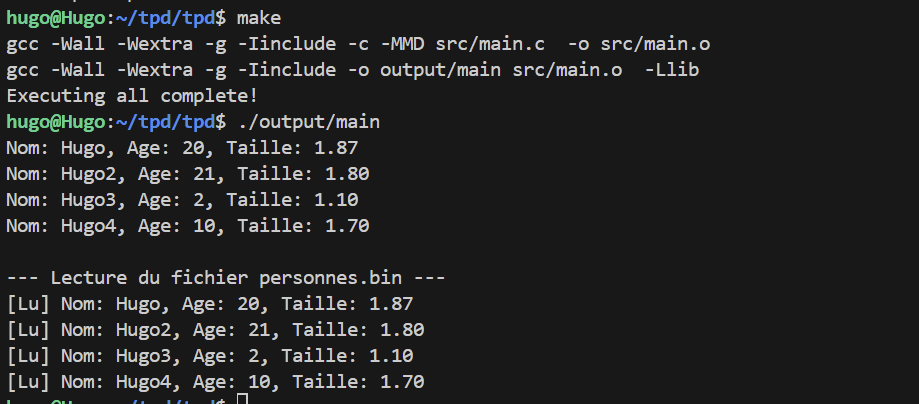
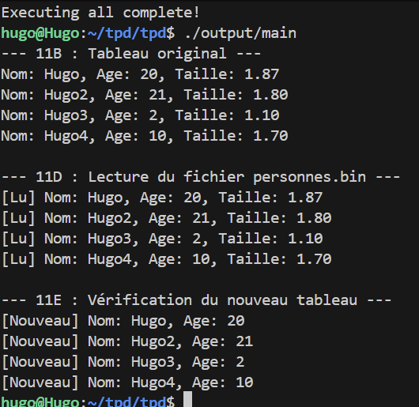
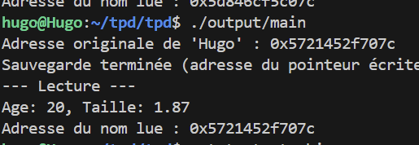

# TPD-Les fichiers et périphériques


## 1. Les périphériques

### 1a) quoi correspondent ces périphériques ?


    /dev/null = tout ce qui est écrit dedans est éffacé c'est une corbeille

    /dev/zero = source infini d'octet 0 

    /dev/random = générateur de nombre aléatoire

    /dev/urandom = autre générateur de nombre aléatoire

    /dev/loop0 = périphérique de boucle 

### 1b)En utilisant les fonctions open (man 3 open ) et read (man 3 read), écrivez un programme qui affiche un nombre aléatoire sur un int.
Programme qui affiche un nombre aléatoire avec /dev/urandom :
```c
#include <stdio.h>
#include <stdlib.h>
#include <fcntl.h>
#include <unistd.h>
#include <errno.h>

int main() {
    int random_int;
    int fd;
    // open le fichier périphérique
    fd = open("/dev/urandom", O_RDONLY);
    if (fd == -1) {
        perror("Erreur lors de l'ouverture de /dev/urandom");
        return EXIT_FAILURE;
    }
    // read la taille d'un entier (sizeof(int))
    // On passe l'adresse de notre variable pour que read la remplisse
    ssize_t bytes_read = read(fd, &random_int, sizeof(int));
    // Affichage du résultat
    printf("Nombre aléatoire lu : %d\n", random_int);
    close(fd);

    return EXIT_SUCCESS;
}
```
## 4. Le système de fichiers /proc

### 4a)  A quoi correspondent les répertoires nommés par des numéros ?
Correspond au procéssus en cours d'utilisation avec le PID correspondant 
### 4b) A quoi correspond le fichier cmdline à l'intérieur d'un de ces répertoires ?
Contient la ligne de commande utilisé pour lancer le processus 
### 4c) A quoi correspond le fichier cwd à l'intérieur d'un de ces répertoires ?
Current Working Directory  :pointe vers le repertoir courant du processus 
### 4d) A quoi correspond le fichier exe à l'intérieur d'un de ces répertoires ?
Le fichier binaire qui execute le processus 
### 4e) Que contient le fichier /proc/devices ?
Liste des pilotes graphiques actuellement chargés.
### 4f) Que pouvez vous dire du répertoire /proc/self ?
Un lien symbolique pointant vers le repertoire du processus qui est en train d'y acceder.

### 4g) Que pouvez vous dire du répertoire /proc/self ?
Le répertoire /proc/self est une entrée qui permet de voir ses propres informations.


## 6. Verrous et opérations sur les fichiers

### 6a) Pourquoi peut-on avoir besoin de verrouiller un fichier en écriture ?
Pour garantir l'intégrité des données. Si deux processus écrivent au même endroit en même temps sans se coordonner, le fichier final sera un mélange corrompu des deux écritures.
### 6b) Écrire un programme qui écrit des valeurs aléatoires dans un fichier. Ce programme devra placer un verrou en écriture (F_WRLCK) sur le fichier. Que ce passe-t-il si vous exécutez deux fois le même programme depuis 2 shells différents. ?

```c
#include <stdio.h>      
#include <unistd.h>     
#include <fcntl.h>     
#include <stdlib.h>    

int main() {
    // Déclaration de la structure qui va définir notre verrou
    struct flock verrou; 
    int fd;
    /*
     O_WRONLY : écriture seule
     O_CREAT : créer le fichier s'il n'existe pas
     O_APPEND : écrire à la fin du fichier 
     0644 : permissions */
    fd = open("test.lock", O_WRONLY | O_CREAT | O_APPEND, 0644);

    // Vérification d'erreur à l'ouverture
    if (fd == -1) { 
        perror("Erreur "); 
        return 1; 
    }

    // --- Config du verrou ---
    verrou.l_type   = F_WRLCK;  // Type : Verrou en Écriture . 
    verrou.l_whence = SEEK_SET; // Point de départ : Début du fichier
    verrou.l_start  = 0;        // Décalage : 0 octet 
    verrou.l_len    = 0;        // Longueur : 0 est une valeur spéciale qui signifie "jusqu'à la fin du fichier" 

    printf("Je demande le verrou...\n");

    // Pose du verrou via fcntl 
    // F_SETLKW : Set Lock Wait. Le 'W' : si le fichier est déjà verrouillé,
    if (fcntl(fd, F_SETLKW, &verrou) == -1) { 
        perror("Erreur fcntl"); 
        return 1; 
    }
    printf("Verrou  ! \n");
    sleep(10); //sleep pour avoir le temps de faire le test
    write(fd, "test hugo test\n", 11);//ecriture de la data pendant le verrou
    printf("Fin écriture, Verrou liberé\n");
    verrou.l_type = F_UNLCK; // Type : Unlock (Déverrouiller)
    // On applique le déverrouillage (F_SETLK )
    fcntl(fd, F_SETLK, &verrou);
    close(fd);
    
    return 0;
}
```
## 8. Parcours d'un répertoire

### 8a) En utilisant les fonctions précédentes, créez un programme qui affiche la taille cumulée de tous les fichiers contenus dans un répertoire.
```c
#include <stdio.h>
#include <dirent.h>
#include <sys/stat.h>
#include <string.h>

int main() {
    DIR *d;
    struct dirent *entree;
    struct stat info_fichier; // Structure décrite dans la partie 8
    long taille_totale = 0;

    // Ouverture du répertoire courant
    d = opendir(".");
    if (d) {
        // Lecture des entrées une par une
        while ((entree = readdir(d)) != NULL) {
            // On ignore "." et ".." pour ne pas boucler
            if (strcmp(entree->d_name, ".") != 0 && strcmp(entree->d_name, "..") != 0) {
                
                // Récupération des infos du fichier
                stat(entree->d_name, &info_fichier);

                //  vérifie si c'est un fichier REG 
                if (S_ISREG(info_fichier.st_mode)) {
                    taille_totale = taille_totale + info_fichier.st_size; // st_size : Total size, in bytes 
                }
            }
        }
        closedir(d);
    }
    
    printf("Taille cumulée : %ld octets\n", taille_totale);
    return 0;
}
```

## 9. Descripteurs de fichiers et fichiers binaires

### 9a) Quelles sont les différentes valeurs (avec leurs symboles) possibles pour le paramètre flags ?
Les flags :  open , O_RDONLY, O_WRONLY, O_RDWR , O_CREAT, O_TRUNC , O_APPEND 
### 9b) Que permet de faire le paramètre mode ?
Permet de définir les parametres d'une fonction
### 9c)  En utilisant les fonctions précédentes, écrire un programme qui sauvegarde la valeur 19496893802562113L dans un fichier binaire. Ouvrez le fichier. Qu'observez-vous ?
```c
#include <stdio.h>
#include <dirent.h>
#include <sys/stat.h>
#include <string.h>
#include <fcntl.h>   
#include <unistd.h>

int main() {
    long val1 = 19496893802562113L;
    int fd1 = open("test.bin", O_WRONLY | O_CREAT | O_TRUNC, 0644);
    write(fd1, &val1, sizeof(long));
    close(fd1);

    return 0;
}
```
Le programme affiche ```ABSURDE```.
### 9d) Créez un programme qui enregistre la valeur 0x4142434451525354L dans un fichier, en utilisant les fonctions précédentes. Affichez la valeur avec un printf en décimal et hexadécimal ? Que contient le fichier binaire ?
```c
#include <stdio.h>
#include <dirent.h>
#include <sys/stat.h>
#include <string.h>
#include <fcntl.h>   
#include <unistd.h>

int main() {
    long val1 = 0x4142434451525354L;
    printf("Dec: %ld, Hex: %lx\n", val1, val1);
    int fd1 = open("test.bin", O_WRONLY | O_CREAT | O_TRUNC, 0644);
    write(fd1, &val1, sizeof(long));
    close(fd1);

    return 0;
}
```
Le fichier binaire affiche : ```TSRQDCBA```

### 9e) Enregistrez la valeur précédente dans un fichier en utilisant la fonction fprintf. Que constatez-vous ?
```c
#include <stdio.h>
#include <dirent.h>
#include <sys/stat.h>
#include <string.h>
#include <fcntl.h>   
#include <unistd.h>

int main() {
    long val1 = 0x4142434451525354L;
    printf("Dec: %ld, Hex: %lx\n", val1, val1);
    int fd1 = open("test.bin", O_WRONLY | O_CREAT | O_TRUNC, 0644);
    write(fd1, &val1, sizeof(long));
    FILE *f1 = fopen("test.txt", "w");
    fprintf(f1, "%ld\n", val1);
    fclose(f1);
    close(fd1);

    return 0;
}
```

Je constate que le fichier txt affiche la donnée brute et non traduit.

### 9f) Quelle est la différence essentielle entre un fichier binaire et un fichier texte ?
Le fichier binaire stocke la valeur exact en mémoire et le ficheir texte stocke les caractères ASCII. Le binaire est lisible pour la machine et le txt est lisible pour l'humain.
### 9g) Que pouvez-vous dire du principe 'little endian' et 'big endian' ?
Little Endian, l'octet de poid faible est stocké en premier
Big Endian, l'octet de poids fort est stocké en premier 
### 9h) A quelle groupe appartiennent les processeurs de la famille des Intel/AMD ?
Intel/AMD appartient à Little Endiant
### 9i) Donnez un modèle de processeur appartenant a l'autre groupe.
ARM, Motorola
### 9j) Il existe d'autres fonctions permettant de lire et d’écrire dans un fichier, qui sont respectivement fread et fwrite. Quelles sont les différences entre read et fread ou write et fwrite ?
Read/ Write sont des appels système, fread/ fwrite sont des fonctions de la bibliothèque C
### 9k) Quelles informations importantes pouvez vous tirer du code précédent ?
Elle contient un buffer char *buffer afin de limiter le nombre d'appels systèmes cela ameliore les performances.
### 9l) En utilisant fwrite, écrire un programme qui enregistre 100 valeurs (de 0 a 100) de type int en binaire dans un fichier et les affiche simultanément. Que pouvez vous observer dans le fichier ?
```c
#include <stdio.h>
#include <dirent.h>
#include <sys/stat.h>
#include <string.h>
#include <fcntl.h>   
#include <unistd.h>

int main() {
    for (int i = 0 ; i < 100 ; i++) {
        FILE *f = fopen ("tab.bin", "wb");
        fwrite(tab, sizeof(int), 100, f);
        fclose(f);
    }
    return 0;
}
```
On ne peut pas lire le fichier tab.bin car c'est illisible
### 9m) Écrire un second programme qui lit les valeurs précédentes du fichier et les affiche ?
```c
#include <stdio.h>
#include <dirent.h>
#include <sys/stat.h>
#include <string.h>
#include <fcntl.h>   
#include <unistd.h>

int main() {
    int tab[100];
    for(int i=0; i<100; i++) tab[i]=i;
    FILE *f = fopen("tab.bin", "wb");
    fwrite(tab, sizeof(int), 100, f); 
    fclose(f);

    // Question 9M
    int tab_lu[100];
    FILE *f2 = fopen("tab.bin", "rb");
    fread(tab_lu, sizeof(int), 100, f2);
    
    return 0;
    
}
```
Cela renvoie : 
```
123456789:;<=>?@ABCDEFGHIJKLMNOPQRSTUVWXYZ[\]^_`abc
```

## 10. Fichiers séquentiels et fichiers a accès direct

### 10a) Écrivez un programme qui enregistre les valeurs de 10 a 30 dans un fichier binaire.
```c
#include <stdio.h>
#include <unistd.h>
#include <fcntl.h>

int main() {

    int fd = open("seek.bin", O_RDWR | O_CREAT | O_TRUNC, 0644);

    //10A
    for (int i = 10 ; i <= 30 ; i++){
        write(fd, &i, sizeof(int));
    } 
    close(fd);

    return 0 ;
}
```

### 10b)  Votre programme doit ensuite relire les données stockées a raison d’une valeur sur trois (vous devez utiliser lseek)
```c
#include <stdio.h>
#include <unistd.h>
#include <fcntl.h>

int main() {

    int fd = open("seek.bin", O_RDWR | O_CREAT | O_TRUNC, 0644);
    int val;
    //10A
    for (int i = 10 ; i <= 30 ; i++){
        write(fd, &i, sizeof(int));
    } 

    // 10 B lire 1/3

    printf("Lecture 1/3\n");
    lseek(fd, 0, SEEK_SET);
    while(read(fd, &val, sizeof(int)) > 0){
        printf("Lu : %d ", val);

        lseek(fd, 2 * sizeof(int), SEEK_CUR); // on saute 2 entiers
    }
    close(fd);

    return 0 ;
}
```

### 10c) Maintenant votre programme doit, en plus, lire la 5ieme valeur enregistrée dans le fichier.

```c
#include <stdio.h>
#include <unistd.h>
#include <fcntl.h>

int main() {

    int fd = open("seek.bin", O_RDWR | O_CREAT | O_TRUNC, 0644);
    int val;
    //10A
    for (int i = 10 ; i <= 30 ; i++){
        write(fd, &i, sizeof(int));
    } 

    // 10 B lire 1/3

    printf("Lecture 1/3\n");
    lseek(fd, 0, SEEK_SET);
    while(read(fd, &val, sizeof(int)) > 0){
        printf("Lu : %d ", val);

        lseek(fd, 2 * sizeof(int), SEEK_CUR); // on saute 2 entiers
    }


    // 10 C Lire la 5 eme valeur enregistré dans le fichier

    printf("\nLecture 5eme valeur\n");
    lseek(fd, 4 * sizeof(int), SEEK_SET); // on se place au 5eme entier
    read(fd, &val, sizeof(int));
    printf("5eme valeur : %d\n", val);
    close(fd);

    return 0 ;
}
```

## 11. Sauvegarde d'une structure


### 11a) Créez un tableau de 4 « Personne »
```c
#include <stdio.h>
#include <unistd.h>
#include <fcntl.h>

typedef struct {
    char nom[20];
    int age;
    float taille;
} Personne;

// ON va crée un tableau de 4 personnes
Personne tableau[4] = {
    {"Hugo", 20, 1.87},
    {"Hugo2", 21, 1.80},
    {"Hugo3", 2, 1.10},
    {"Hugo4", 10, 1.70}
};


```
### 11b) Affichez les données stockées dans les structures (nom, age et poids de chaque « Personne »)
```c
#include <stdio.h>
#include <unistd.h>
#include <fcntl.h>
#include <string.h> 

int main(){
    typedef struct {
        char nom[20];
        int age;
        float taille;
    } Personne;

    // ON va crée un tableau de 4 personnes
    Personne tableau[4] = {
        {"Hugo", 20, 1.87},
        {"Hugo2", 21, 1.80},
        {"Hugo3", 2, 1.10},
        {"Hugo4", 10, 1.70}
    };
    // 11 B on affiche le tableau
    for (int i = 0; i< 4; i++){
        printf("Nom: %s, Age: %d, Taille: %.2f\n", tableau[i].nom, tableau[i].age, tableau[i].taille);
    }
    return 0;
}
```
### 11c) Créez une fonction qui sauvegarde le contenu du tableau dans un fichier binaire.
```c
#include <stdio.h>
#include <unistd.h>
#include <fcntl.h>
#include <string.h> 

void sauvegarder(const char* filename, const void* data, size_t size) {
    int fd = open(filename, O_WRONLY | O_CREAT | O_TRUNC, 0644);
    write(fd, data, size);
    close(fd);
}
int main(){
    typedef struct {
        char nom[20];
        int age;
        float taille;
    } Personne;

    // ON va crée un tableau de 4 personnes
    Personne tableau[4] = {
        {"Hugo", 20, 1.87},
        {"Hugo2", 21, 1.80},
        {"Hugo3", 2, 1.10},
        {"Hugo4", 10, 1.70}
    };
    // 11 B on affiche le tableau
    for (int i = 0; i< 4; i++){
        printf("Nom: %s, Age: %d, Taille: %.2f\n", tableau[i].nom, tableau[i].age, tableau[i].taille);
    }

    // 11 C on sauvegarde le tableau dans un fichier binaire
    sauvegarder("personnes.bin", tableau, sizeof(tableau));
    return 0;
}
```
### 11d) Créez une fonction qui lit les données du fichier précédent et les affiche au fur et à mesure de la lecture. Vous devez bien sur retrouver les données qui étaient stockées dans les structures.
```c
#include <stdio.h>
#include <unistd.h>
#include <fcntl.h>
#include <string.h> 
typedef struct {
        char nom[20];
        int age;
        float taille;
    } Personne;


void sauvegarder(const char* filename, const void* data, size_t size) {
    int fd = open(filename, O_WRONLY | O_CREAT | O_TRUNC, 0644);
    write(fd, data, size);
    close(fd);
}


void lire_et_afficher(const char* filename) {
    Personne p_tampon; // Une variable temporaire pour stocker une personne lue
    int fd = open(filename, O_RDONLY);
    printf("\n--- Lecture du fichier %s ---\n", filename);
    while(read(fd, &p_tampon, sizeof(Personne)) > 0) {
        printf("[Lu] Nom: %s, Age: %d, Taille: %.2f\n", 
               p_tampon.nom, p_tampon.age, p_tampon.taille);
    }
    close(fd);
}
int main(){


    // ON va crée un tableau de 4 personnes
    Personne tableau[4] = {
        {"Hugo", 20, 1.87},
        {"Hugo2", 21, 1.80},
        {"Hugo3", 2, 1.10},
        {"Hugo4", 10, 1.70}
    };
    // 11 B on affiche le tableau
    for (int i = 0; i< 4; i++){
        printf("Nom: %s, Age: %d, Taille: %.2f\n", tableau[i].nom, tableau[i].age, tableau[i].taille);
    }

    // 11 C on sauvegarde le tableau dans un fichier binaire
    sauvegarder("personnes.bin", tableau, sizeof(tableau));

    // 11 D on lit et affiche le contenu du fichier binaire
    lire_et_afficher("personnes.bin");
    return 0;
}
```

### 11e) Créez une fonction qui lit les données du fichier précédents et les stocke dans un tableau de « Personne »
```c
#include <stdio.h>
#include <unistd.h>
#include <fcntl.h>
#include <string.h> 

typedef struct {
    char nom[20];
    int age;
    float taille;
} Personne;

// Fonction 11C
void sauvegarder(const char* filename, const void* data, size_t size) {
    int fd = open(filename, O_WRONLY | O_CREAT | O_TRUNC, 0644);
    if (fd == -1) { perror("Erreur open save"); return; }
    write(fd, data, size);
    close(fd);
}

// Fonction 11D
void lire_et_afficher(const char* filename) {
    Personne p_tampon; 
    int fd = open(filename, O_RDONLY);
    if (fd == -1) { perror("Erreur open read"); return; }

    printf("\n--- 11D : Lecture du fichier %s ---\n", filename);
    while(read(fd, &p_tampon, sizeof(Personne)) > 0) {
        printf("[Lu] Nom: %s, Age: %d, Taille: %.2f\n", 
               p_tampon.nom, p_tampon.age, p_tampon.taille);
    }
    close(fd);
} 

// Fonction 11E (Sortie de la fonction précédente)
void dans_tableau(const char* filename, Personne* tableau_dest, size_t taille_a_lire) {
    int fd = open(filename, O_RDONLY);
    if (fd == -1) { perror("Erreur open 11E"); return; }
    
    // On remplit le tableau destination directement
    read(fd, tableau_dest, taille_a_lire);

    close(fd);
}

int main(){
    // 11A : Création
    Personne tableau[4] = {
        {"Hugo", 20, 1.87},
        {"Hugo2", 21, 1.80},
        {"Hugo3", 2, 1.10},
        {"Hugo4", 10, 1.70}
    };

    // 11B : Affichage mémoire
    printf("--- 11B : Tableau original ---\n");
    for (int i = 0; i< 4; i++){
        printf("Nom: %s, Age: %d, Taille: %.2f\n", tableau[i].nom, tableau[i].age, tableau[i].taille);
    }

    // 11C : Sauvegarde
    sauvegarder("personnes.bin", tableau, sizeof(tableau));

    // 11D : Lecture simple
    lire_et_afficher("personnes.bin");

    // 11E : Chargement dans un nouveau tableau
    Personne nouveau_tableau[4];
    dans_tableau("personnes.bin", nouveau_tableau, sizeof(nouveau_tableau));

    // Vérification pour la 11E (Preuve que ça a marché)
    printf("\n--- 11E : Vérification du nouveau tableau ---\n");
    for (int i = 0; i< 4; i++){
        printf("[Nouveau] Nom: %s, Age: %d\n", nouveau_tableau[i].nom, nouveau_tableau[i].age);
    }

    return 0;
}
```


### 11f) Même exercice que précédemment (reprenez toutes les questions), mais cette fois avec la structure suivante :
```c
#include <stdio.h>
#include <stdlib.h>
#include <unistd.h>
#include <fcntl.h>
#include <string.h>

// Nouvelle structure avec POINTEUR
typedef struct {
    char *nom; 
    int age;
    float taille;
} Personne;

// Fonction de sauvegarde
void sauvegarde(const char* filename, Personne* p) {
    int fd = open(filename, O_WRONLY | O_CREAT | O_TRUNC, 0644);
    
    // Cela écrit l'âge , la taille,  mais pas le nom
    // On écrit l'adresse mémoire 
    write(fd, p, sizeof(Personne));
    
    close(fd);
    printf("Sauvegarde terminée (adresse du pointeur écrite).\n");
}

void lecture(const char* filename) {
    Personne p_lu;
    int fd = open(filename, O_RDONLY);
    
    read(fd, &p_lu, sizeof(Personne));
    close(fd);

    printf("--- Lecture ---\n");
    printf("Age: %d, Taille: %.2f\n", p_lu.age, p_lu.taille);
    
    printf("Adresse du nom lue : %p\n", (void*)p_lu.nom);
    
}

int main() {
    Personne p;
    
    // On doit donner une adresse valide au pointeur
    // "Hugo" est stocké quelque part dans la mémoire du programme
    p.nom = "Hugo"; 
    p.age = 20;
    p.taille = 1.87;

    printf("Adresse originale de 'Hugo' : %p\n", (void*)p.nom);

    // 1. Sauvegarde
    sauvegarde("test.bin", &p);

    // 2. Lecture
    lecture("test.bin");

    return 0;
}
```

