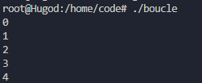
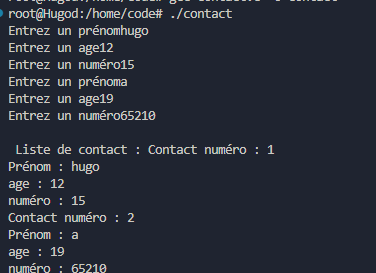

# Cours de c :


## Base : 
### Comment Compiler ?
*On va utiliser gcc :*
```
gcc "nom_du_fichier.c" //cela va renvoie un "a.out" c-a-d un executable 
//---Pour nommer l'executable---

gcc "nom_du_fichier.c" -o "nom_de_lexecutable" // -o permet de nommer l'output.
```

### Prinft + Variables : 
La fonction printf permet d'afficher dans la console.
Appelée dans printf : 
```
Entier : printf("Entier %d \n", entier);
Float : printf("Flottant %.2f \n", flottant);
Char : printf("caractère %c\n", caractere);
```
Entier = %d
Float = %f pour les nombres à virgules : %.2f
Char = %c
Str = %s
longueur = %lu
pointeur = %p


*Code montrant comment utiliser des variables :*
```c
#include <stdio.h>

int main(void)
{
    //Initialisation des trois variables
    int entier = 10;
    float flottant =10.15;
    char caractere = 'A';
    
    printf("Entier %d \n", entier); // appel des trois variables avec printf
    printf("Flottant %.2f \n", flottant);
    printf("caractère %c\n", caractere);

    printf("Entier : %d, Flottant : %.2f , Char : %c \n", entier,flottant,caractere);
}
```


### Scanf :

La fonction Scanf permet de lire lire des données formatées à partir d'une entrée 

*Exemple d'utilisation :*
```c
#include <stdio.h>

int main(void){

    int nombre; //initialisation de la variable nombre
    printf("Entrez un nombre :");//affiche sur la console "entrez un nombre"
    scanf("%d",&nombre);// utilisation de la fonction scanf sur l'adresse mémoire de nombre
                        // on récupère ce que l'utilisateur a écrit après "entrez un nombre"
    printf("Nombre =%d\n", nombre); // Puis affichage de ce dernier
    return 0;
}
```

*Ce que cela renvoie :*


### Exercice Simple :

*Crée un programme C qui demande une température en Celsius et la convertie grâce à la formule Celsius x 1.8 + 32*

#### Résolution : 
```c
#include <stdio.h>

int main(void){
    float temperature_celcius; //temperature choisis a convertir
    float temperature_fahrenheit; //resultat pour après
    printf("Entrez la température que vous voulez convertir en fahrenheit : ");
    scanf("%f",&temperature_celcius); //on recupere la valeur choisis
    printf("Vous avez choisis : %.2f \n", temperature_celcius); // on l'affiche
    temperature_fahrenheit = (temperature_celcius * 1.8 ) + 32 ; //on fait le calcul de conversion (C *1.8)+32
    printf("Cela donne %.2f \n",temperature_fahrenheit);// On l'affiche
}
```

### Arithmetique :

On va maintenant voir les différents calculs possibles les basiques : 
    1. Somme
    2. Difference
    3. Produit
    4. Quotient
    5. Modulo

*A travers ce code vous trouverez des exemples de chacuns des 5 calculs :*

```c
#include <stdio.h>

int main(void){
    int a = 10, b = 5; //manière rapide d'assigner des valeurs à plusieurs variables du même types

    int somme = a + b;
    int difference = a - b;
    int produit = a * b;
    float quotient = a / b;
    int modulo = a % 3; //reste de la division (ex : 5 % 3 = 2)

    printf("%d\n",somme);
    printf("%d\n",difference);
    printf("%d\n",produit);
    printf("%.2f\n",quotient);
    printf("%d\n",modulo);

    return 0;
}
```

## Les conditions :

### Le IF (SI) : 

*Voici un code explicaiton l'utilision d'un IF, ELSE IF, ELSE*
En commentaire au dessus de la fonction main, il y a une explications des comparateurs.

```c
#include <stdio.h>


int main(void){
    // types de compateur : 
    /* 
    les retours : 1 = True et 0 = False
    1. Le "=="  si l'affirmation est vrai. Exemple : 5 == 3; va retourner 0 car 5 est differents de 3.
    2. le "!=" signifie "différent de". Exemple : 5 != 3; va retoruner 1 car 5 est different der 3
    3. le " < " plus petit que ou ">" plus grand que. Exemple : 5 < 3; va retoruner 0 car 5 est plus grand que 3
    4. le "<=" ou ">=" même principe mais on inclus le 3 supérieur ou égal / inférieur ou égal.
    */
    int nombre;
    printf("Choisir un nombre : ");
    scanf("%d", &nombre);

    // on veut print savoir si le nombre est positif / négatif ou égal à 0

    if (nombre > 0 ){ //si le nombre est supérieur à 0 
        printf("Le nombre est positif \n");
    }
    else if (nombre < 0){//si le nombre est inférieur à 0 
        printf("le nombre est négatif \n");
    }
    else { //si il est ni supérieur ni inférieur alors c'est 0
        printf("Le nombre est zéro \n");
    }


    return 0;
}
```
### Le ET LOGIQUE :
*Le ET logique (&&) retourne vrai que si les deux conditions sont juste.*

Il s'écrit de la sorte : 

```printf("%d\n", 1 == 1  && 0 == 1); ```
Cela va retourner 0 donc FALSE


### Le OU logique

*Le OU LOGIQUE (||) retorune vrai si une ou l'autre conditions est juste (ou les deux)*

Il s'écrit de la sorte : 

```printf("%d\n, 1 == 1 || 0 == 1);```
Cela va retourner 1(True) car une condition est juste (1 == 1).


### A savoir :

La priorité est la suivante : Le OU est prioritaire au ET. Donc si il y a un OU et un ET alors le OU sera prioritaire. (Explication exo en dessous).


### Exercice :
*Il faut crée un programme qui determine si une année est bisextile ou non*

### Résolution d'exercice : 
```c
#include <stdio.h>

int main(void){

    int annee;
    printf("Donnez une année pour savoir si elle est bissextile : ");
    scanf("%d",&annee);
    /*
    Une année bisextile doit réunir 3 condtions :
    1. Divisible par 4.
    2. Pas divisible par 100.
    3. Sauf si divisible par 400.
    Si divisible par 400 alors la règle 2 n'est pas prise en compte
    */
    if (annee % 4 == 0 && annee % 100 != 0 || annee % 400 == 0){
        printf("L'année %d est bissextile\n",annee);
    }
    else{
        printf("L'année %d est pas bissextile\n",annee);
    }
}
```


## Les Boucles :

### While 

```c
#include <stdio.h>

int main(void){
    /*
    Boucle WHILE (tant que) :
    On veut faire un boucle qui affiche un chiffre 5 fois jusqu'à que i = 5
    On doit l'incrémenter a chaque passage
    */
    int i = 0;
    while(i < 5){ // tant que i est inférieur a 5
        printf("%d\n",i);
        i = i+1;//increment de i
    }
    return 0;
}
```
*Lorsque on lance le programme :*


### Do While : 

```c
#include <stdio.h>

int main(void){
    
    /*
    Boucle DO WHILE (Fais ... tant que ... ) :
    Même principe sauf que l'on fait quelque chose avant de lancer la boucle
    Exemple ici si i est > a 5 alors il va pas afficher 0,1,2,3,4
    mais simplement le i puis fermer le programme 
    */
    int i = 10;
    do {
        printf("%d\n", i);
        i = i+1;
    } while ( i < 5);
    return 0;
    
}
```


### FOR :

*Programe simple expliquant la boucle FOR de manière la plus triviale possible :*

```c
#include <stdio.h>

int main(void){
    
    /*
    Boucle FOR (Pour ...)
    Se construit de cette manière : for(variable ; condition ; incrémentation)
    */
    for (int i = 0; i < 5 ; i++)
    {
        printf("%d\n", i);
    }
}
```


Autre exemple : 

```c
#include <stdio.h>

/*
On veut demander un nombre puis parcourir de 0 à ce nombre pour ajouter chaque nombre qu'il possèe et en faire la somme 
exemple 5 : 0+1+2+3+4+5 = 15
*/

int main(void)
{
    int nombre;
    int somme = 0;
    printf("Choisir un nombre : ");
    scanf("%d",&nombre);
    
    for (int i = 0; i <= nombre ; i++){ // pour i = 0 ; tant qu'il est pas = a 5 ; i +1
        somme += i; // on ajoute i à la somme
    }
    printf("%d est la somme de tout les nombres de %d\n",somme,nombre);
    return 0;
}
```


### Exercice
Ecrire le résultat d'un terme donné par l'user avec la suite de fibonnaci exemple rang 5 de fibonnaci = 8
Fibonnaci : addition des deux derniers termes
0 + 1 + 1 + 2 + 3

Donnée connu : 
Terme 1 = 0
Terme 2 = 1

### Résolution :

```c

int main(void){
    /*
    Suite de fibonnaci :
    On doit ajouter les deux dernier termes de la suite avec le nombre de terme
    */
   int fib1 = 0; //terme 1 de fibnonnaci
   int fib2 = 1; //temre 2 de fibonncaci
   int terme;
   int somme = 0;
    printf("Combien de termes voulez vous affichez");
    scanf("%d",&terme);

    for (int i = 0 ; i < terme ; i++){ // on parcours jusqu'au terme demandé
        somme = fib1 + fib2; //somme sera le résultat final on additionne terme -2 et terme -1
        fib1 = fib2; // on remplace terme -2 par terme -1
        fib2 = somme; // on remplace terme -1  par resultat terme
    }
    printf("Le rang %d de la suite de fibonacci est %d \n",terme,somme);
    
    return 0;
}
```


### Les Fonctions : 

La base des fonctions : 
On va crée une fonction qui permet d'additonner : 

```c
#include <stdio.h>

int addition(int a, int b){ // fonction avec paremetre deux entier a et b
    return a + b; // l'addition basique
}


int main(void){
    int somme = addition(5,35);// on appelle la fonction addition dans la variable somme pour que 5 et 35 s'additionne 
    // donc a = 5 et b = 35
    printf("La somme est %d\n",somme);
    return 0;
}

```

### Les tableaux :

Crée un tableau puis l'afficher : 
Syntaxe : tableau[LongTableau] = {1,2,3,4,5,6};

```c
#include <stdio.h>

int main(void){

    float notes[] = {15.5,9.7,18,1.3};// on peut faire notes[4] pour dire qu'il y a quatre éléments 

    for (int i = 0 ; i < 4 ; i++){ // on boucle sur le tableau pour afficher chaque note
        printf("La note est : %2f\n",notes[i]); // on affiche le rang (i) à chaque appel
    }

    return 0;
}
```

### Les Tableaux a doubles entrées : 

```c
#include <stdio.h>

int main(void)
{

    int tableau[2][3] = {{1,2,3},{4,5,6}}; // tableau multi dimensions
    for (int i = 0; i < 2 ; i++)// on parcours le premier tableau (de 2)
    { 
        for (int j = 0; j< 3 ; j++) // on parcours le deuxieme tableau (de 3)
        {
            printf("%d" , tableau[i][j]);
        }
        printf("\n");
    }
    return 0;
}
```

### Les chaines de caractères : 

```c
#include <stdio.h>

int main(void)
{
    //Pour initialiser une chaines de charactères : 
    char prenom[32]; // prenom[32] est la variable str, 32 est le nb de charactères alloué max.
    printf("Entrez votre prénom : ");
    scanf("%s",prenom); //pas besoin de pointeur car prenom point vers une adresse mémoire car un tableau sans {} est un pointeur vers la première case du tableau
    printf("Bonjour, %s \n",prenom);
    return 0;
}
```

fonction internes au strings : 
    - longueur d'un mot : strlen() : changer le %s en %lu


### Les Pointeurs : 

```c
#include <stdio.h>


void add_one (int *number)// ICI * signifie l'adresse de la variable number 
{
    printf("Adresse de numbre %p\n", number);
    *number = *number + 1; // on modifier la valeur de l'entier stocker à l'adresse 
}


int main(void)
{

    int value = 42;

    printf("Value : %d \n", value);
    printf("Adresse de value : %p \n", &value);

    add_one(&value); // on appelle la fonction sur value mais avec le pointeur pour modifier la variable

    printf("Value : %d\n", value);
    return 0;
}

```


### Les Structures : 

#### Exemple :

```c
#include <stdio.h>


struct Student {
    char prenom[50];
    int age;
    float notes[10];
};


int main()
{
    struct Student s1;
    printf("Entrez un prénom : ");
    scanf("%s", s1.prenom);


    printf("Entrez un age : ");
    scanf("%d", &s1.age);

    printf("Prénom : %s\n", s1.prenom);
    printf("Age : %d \n",s1.age);

    return 0;
}

```

### Exercice

*Exercice sur la structure, les pointeurs, les tableaux, le scanf etc*

Il faut crée une liste de contact avec nom prenom et numéro de telephone
Puis afficher la liste de contact : 


```c
#include <stdio.h>

/*
Création d'une structure contact avec prénom numéro et age
*/
struct Contact 
    {
        char prenom[30];
        char numero[10];
        int age;
    };

int main(void){
    struct Contact contacts[2]; // on initialise le tableau de 2 contacts via la structure
    for (int i = 0; i < 2 ; i++){ // on parcours le tableau pour le remplir
        printf("Entrez un prénom");
        scanf("%s", contacts[i].prenom);

        printf("Entrez un age");
        scanf("%d", &contacts[i].age);// on pointe seulement pour le int ici avec &

        printf("Entrez un numéro");
        scanf("%s", contacts[i].numero);
    
    
    } printf("\n Liste de contact : "); //maintenant on veut afficher la liste de contact
    for (int i = 0 ; i < 2 ; i++)//on reparcours les contacts
    {
        printf("Contact numéro : %d\n", i + 1 );
        printf("Prénom : %s\n", contacts[i].prenom);//on affiche le prenom en parcours le tableau à l'indice i
        printf("age : %d\n", contacts[i].age);//pareil
        printf("numéro : %s\n", contacts[i].numero); // pareil
    }


    return 0;
}
```

#### *Résultat*
