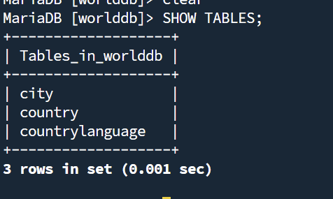
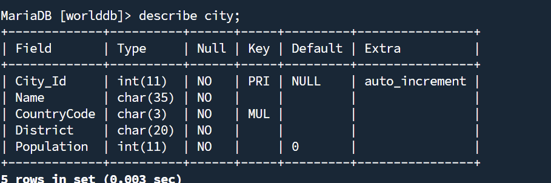
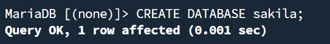
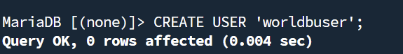
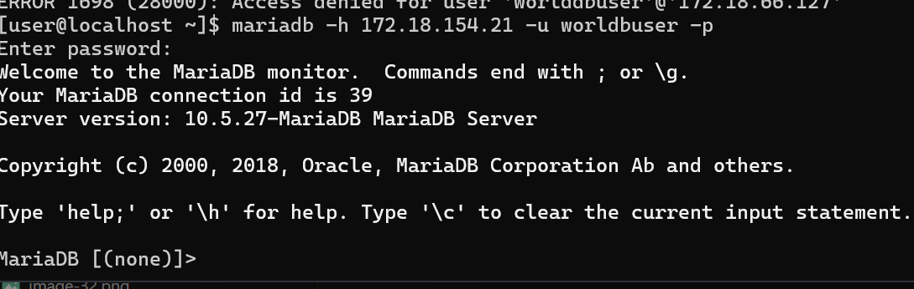

# Linux TD2 – MySQL/MariaDB
```bash
ip vm : 172.18.154.21
login : user
passw : User@dmin!
```


Installation : 
Tunnel : 

SSH Vm2 : 

# 2 : Désactivation du pare-feu.


# 3 : Installation

### Installez le package mariadb-server

### a) Installez le package mariadb. Que contient ce package ?


Le package contient toutes les dépendances ci dessus.

### b) Qu’est ce que mariadb par rapport a mysql ?
MariaDB est un fork de MYSQL, crée par les créateur de MYSQL. MariaDB est une version indépendante.

# 4 : Prise en main

### a) Quel est le fichier de configuration de configuration de mariadb ?

### b) Quel est son format ?

### c) Quel est une de ses particularités ?
Le fichier de configuration est bien organisé et bien rangé.
### d) Quel est le répertoire de travail utilisé par le serveur pour stocker les bases de données?
Le dossier est ```/var/lib/mysql```
### e) Cet emplacement vous semble-t-il pertinent ? Justifiez votre réponse.
Non car il se trouve sur le disque principal et si le disque est pleins alors les bases de données seront vites limités en stockages.
### f) Proposez une configuration plus conforme a celle d’un serveur de production.
Il faudrait : un disque spécifiquement pour le serveur mysql.
Puis copier les données du dossier à l'autre avec 

# 5 . Démarrez le service mariadb

### a) Sur quel port est a l’écoute le service mariadb par défaut ? Quelle commande avez-vous utilisé ?
Par défaut mariadb écoute sur 3306.

### b) Sur quelle·s IP le service est-il a l’écoute ?
Le service est à l'écoute sur toutes les l'adresses

On le voit avec le "*".

# 6 . Connexion au service

### a) Quelle commande vous permet de joindre votre serveur mariadb ?
```sudo mariadb```

### b) Que permet de faire l’option  --protocol ?
Permet de forcer le protocole utilisé. Tel que tcp par exemple.
### c) Quelle est l’autre méthode permettant de joindre un service mariadb ? Quelle est sa limite ?
On peut utiliser un socket unix. Cependant cela fonctionne que en Local.
### d) Quel est le protocole utilisé par défaut par le client (cf la commande précédente ) pour joindre le service mariadb ? Comment l’avez vous prouvé ?

La commande ```status``` permet d'affichger le protocole utilisé. on voit ici qu'on se connecte en socket unix vial a commande sudo mariadb.

# 7 . Sécurisation

### a) Quel est le compte administrateur utilisé par mariadb ?
Le compte est ```root```
### b) Que ce passe-t-il si vous tentez de vous connecter sur le service mariadb et utilisant l’IP de la VM ? (l’IP , pas l’adresse de bouclage!!)

On se fait refuser la connection.
### c) Que ce passe-t-il si vous utilisez l’adresse 127.0.0.1. Comment avez-vous prouvé que vous êtes bien connecté en TCP/IP. Quelle commande avez-vous utilisé pour le prouver ? Quelle commande avez-vous utilisé pour vous connecter ?


### d) Même question que précédemment, mais en utilisant localhost.
Et maintenant ça marche : 

### e)  Vous avez constaté que le serveur ne demande jamais de mot de passe. Sur quoi repose la sécurité des données ? Quels sont les risques sur un serveur de production hébergeant par exemple un service Apache, Tomcat ou autre et le service mariadb ?
Le problème est que le mot de passe est quelque chsoe de privé et l'user un truc en autre publique donc si quelqu'un arrive à être root il pourra directement se connecter sans mdp.

### Le script mysql_secure_installation permet de sécuriser une installation de mariadb.
```sudo mysql_secure_installation```
### Fixer un mdp pour le compte root
### Supprimer le compte anonyme
### Autorisez les accès distants pour le compte root
### Laissez la DB test sur le serveur
### Accepter l’application immédiate des changements (Flush des privilèges)


# 8 . Création d'une DB via un script SQL

### a)  Créer la DB worlddb. Comment avez-vous procédé ?
### b) Affichez la liste des DB gérées par mariadb ?


### c) Injecter le script WORLDDB-FINAL-UTF8.sql. Quelle commande avez vous utilisée ?


Il faut envoyer le fichier dans worlddb.

### d)  Quelles sont les tables présentes ? Quelle commande avez vous utilisé ?

### e) Combien de pays sont stockés dans la DB ?

### f) Donnez un schéma de la DB.
```country```

```city```

```countrylanguage```

### g) Le fichier sakila-db.zip contient une DB de démonstration.



### h) Affiché les 5 premiers acteurs de la DB sakila (table actor)

### I) Quelles sont les DB gérées par le serveur ?
Celles-la : 

### j) Supprimez la DB sakila, et vérifiez la suppression. Quelles commandes avez vous utilisées ?


# 9 . Gestion des comptes et accès

### a) Quelles seraient les conséquences possibles si l’application web, par exemple, présente des failles de sécurité ?
Les conséquences seraient : 
- Une fuite de données
- Une modifications de données
### b) Qu’est ce qu’une injection SQL ?
Une injection SQL est un type d'attaque où l'attaquant envoie une requete SQL dans un formulaire.
### c) Créez un compte « worldbuser ». Quelle commande SQL permet de créer un utilisateur ?

### d) Donnez tous les droits a l’utilisateur « worldbuser » sur la DB « worlddb ». Quelle commande SQL permet de donner tous les droits sur une DB a un utilisateur particulier ?

"*" signifie toutes les tables de la base worlddb
### e) Quelle commande SQL permet de voir les permissions pour un utilisateur ? Quels sont les droits pour l’utilisateur « worlddbuser » ?

### f) A quoi sert la commande SQL « FLUSH PRIVILEGES ; » ?
Elle permet de recharger la table de permissions.
### g) Comment prouver que les accès sont bien fonctionnels pour le compte « worlddbuser ».
En se connectant à worlddbuser

### h) Quelles sont les tables accessibles avec le compte « worlddbuser ». Quelles commandes avez-vous utilisées pour le prouver ?

### i) Quelle commande SQL permet de révoquer des droits ?
La commande par exemple pour revoke les droit à worlddb à worldbuser : 
```
REVOKE DELETE ON worlddb.* FROM 'worldbuser';
``` 
### j) A quoi sert le script mysql_setpermission ?
```mysql_setpermission``` est un script qu iguide l'admin à travers plusieurs questions pour mettre des permissions.
### k) A quoi sert le script mysqlaccess ?
```mysqlaccess``` est un script utilisé pour vérifier si un utilisateur possède des permissions.

# 10 . Sauvergarde et restauration

### a) Quels sont les principaux dangers liés à une mauvaise sécurité ?
- Perte de données
- Vols de données
### b) Changer la population de tous les pays en la fixant a 10. Donnez la commande utilisée.

### c) Faire une sauvegarde de la DB « worlddb » en nommant le script dump-worldb.sql.
```bash
 mysqldump -u root -p worlddb > dump-worldb.sql
```
### d) Quelle commande est utilisable pour faire une restauration d’une DB ?
```bash
mariadb -u root -p worlddb < dump-worldb.sql
```

### e) Qu’est ce qu’une sauvegarde logique ?
Une sauvergarde logique consiste à exporter des données dans un format qu'un humain peut lire.
### f) Quels sont les différents type de sauvegardes physiques ?
- Cold Backup : serveur arrêté
- Hot Backup : serveur en cours d'execution
### g) Quelles autres commandes sont utilisées pour faire une sauvegarde ?
```bash 
mariadbbackup [--backup -- targ-dir -- user -- password]
```

### h) Quel type de sauvegarde est proposé ?
Une sauvergarde incrémentielle.
### i) Quels avantages présente-t-il ?
Les avantages : 
- Plus rapide car elle sauvergarde que les nouvelles données.
- Prend moins de place sur le disque.
### j) Quels sont les problèmes posés par ce type de sauvegarde ?
Plus compliqué à restauré.

# 11 . Outils graphiques.

### a) Quel est l’intérêt d’une connexion a travers un tunnel SSH ?

L'intérêt d'une connexion à travers un tunnel SSH est : 
- le chiffrement des données
- le contournement des pare-feu

# 12 Réplication comme solution de sauvegarde ?

### a) Quels sont les limites de la réplication ?
Si l'admin supprime des données sur le serveur maitre alors tout le monde aura les données supprimés
Si les données sont deviennent corrompues, la corruption sera aussi sur les esclaves.
### b) Quels sont les usages courant des serveurs de réplications? (https://mariadb.com/kb/en/mariadb-maxscale-22-maxscale-failover-with-keepalived-and-maxctrl/)

 - HIGH AVAILABILITY : Si le MAITRE tombe en panne alors l'ESCLAVE peut devenir le nouveau MAITRE

 - LOAD BALANCING : Une app qui utilisent beaucoup de données simultanément peut répartir les perfommances sur les esclaves pour être plus perfomants.


### c) Créez une nouvelle VM, installez mariadb et les outils nécessaires

### d) Vérifiez la connectivité entre les VMs
Ping : 
 

 Accès à mariadb depuis esclave :
 

 ### e) Configuration du serveur maitre (/etc/my.cnf.d/server.cnf, ne pas oublier de redémarrer le service après la création du fichier)


```bash 
sudo nano /etc/my.cnf.d/mariadb-server.cnf
```


```bash 
sudo systemctl restart mariadb
```

### e) Création d’un compte pour la réplication ou attribution des droits sur un compte existant sur le serveur maitre


### g) Configuration des esclaves (/etc/my.cnf.d/server.cnf)


