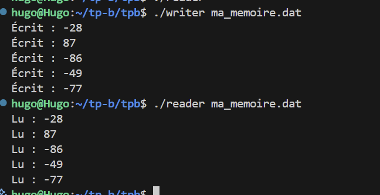

# 2.3 Signaux 

### 2.3a )La fonction sigaction permet de définir un handler pour un signal. En respectant les points particuliers mis en exergue dans les paragraphes précédents vous devez :  Écrire un programme qui se « forke » en 5 enfants. /  Toutes les secondes sur une durée de 30 secondes, le processus père doit envoyer un signal SIGUSR1 a l’un des enfants. / Le processus recevant le signal SIGUSR1 doit afficher le message « Hello from PID », PID étant le pid du processus enfant. / Une fois les 30 secondes écoulées, le processus parent doit envoyer un signal SIGINT aux 5 processus enfants (Attention aux processus Zombie)

Ce  code repond à tous les critère demandé par l'énoncé. Le résultat plus bas :
``` c
#include <stdio.h>
#include <stdlib.h>
#include <unistd.h>      // Pour fork(), getpid(), sleep(), pause()
#include <signal.h>      // Pour sigaction(), kill(), sigemptyset()
#include <sys/wait.h>    // Pour wait()
#include <time.h>        // Pour time() et srand()

#define NUM_CHILDREN 5 // On définit le nombre de fils a 5 comme le dit l'énoncé


//FLAG Gestionaire de signal

//volatile signifie que la variable peut être modifiés par des signaux
// sig_atomic_t est un type entier garanti d'etre modifié atomiquement 
volatile sig_atomic_t sigusr1_received = 0; // Variable pour indiquer la réception du signal


// Gestionaire de signal pour SIGUSR1
void handle_sigusr1(int sig) {
    (void)sig; // Correction : Pour enlever le warning "unused parameter"
    sigusr1_received = 1; // On met a jour la variable pour indiquer la réception du signal
}

// Fonction pour le processus fils
void child_logic(void){
    //configuration du gest de signal avec sigaction()
    struct sigaction sa; // Correction : La variable est renommée "sa"
    sa.sa_handler = handle_sigusr1; // On assigne le gestionnaire de signal
    sigemptyset(&sa.sa_mask); // On initialise le masque de signal a vide
    sa.sa_flags = 0; // Pas de drapeaux spéciaux

    //on lie le gestionnaire de signal SIGUSR1
    // Correction : On appelle la FONCTION sigaction() avec la VARIABLE sa
    if (sigaction(SIGUSR1, &sa, NULL) == -1) { 
        perror("sigaction");
        exit(1);
}
//Le signal SIGINT gardera son comportement par défaut : terminer le processus 


//maintenant la boucle principale du fils : 
    while (1) {
        pause(); //met en pause le processus jusqu'à la réception d'un signal

        //on va vérifié si c'est SIGUSR1 qui a été reçu
        if (sigusr1_received) {
            sigusr1_received = 0; // on réinitialise la variable
            printf("Le fils%d a reçu le SIGUSR1\n", getpid());

        }
    }
    //le fils ne sortira jamais de cette boucle
    //il est prévu qu'il soit tué par le père
}

void parent_logic(pid_t child_pids[]){ 
    //on initilise le générateur de nombre aléatoire
    srand(time(NULL));
    printf("Père PID : %d\n", getpid());
    printf("Lancement de %d enfant \n", NUM_CHILDREN);

    //on sleep 1 seconde pour laisser le temps aux fils de s'initialiser
    sleep(1);

    printf("Père PID : %d\n", getpid());
    printf("Envoi des signaux SIGUSR1 aux enfants\n");


    //on entre dans un boucle de 30 secondes on envoie des signaux SIGUSR1 aux fils
    for (int i = 0; i < 30; i++) {
        //on choisit un fils au hasard
        int random_index = rand() % NUM_CHILDREN;
        pid_t child_pid = child_pids[random_index];
        // Envoie le signal SIGUSR1 à l'enfant ciblé
        kill(child_pid, SIGUSR1);

        //on attend 1 seconde avant d'envoyer le prochain signal
        sleep(1);
    }
    //Après 30 secondes on termine les fils
    printf("Père PID : %d\n", getpid());
    printf("Terminaison des enfants\n");
    for (int i = 0; i < NUM_CHILDREN ; i++) {
        kill(child_pids[i], SIGINT); //on envoie le signal SIGINT pour terminer les fils
    }
        


    //maitenant on va éviter les processus zombies 
    printf("Père PID : %d\n", getpid());
    printf("Attente de la terminaison des enfants\n");
    for (int i = 0; i < NUM_CHILDREN ; i++) {
        int status;
        wait(&status); //on attend la terminaison de chaque fils
    }
    printf("Tous les enfants ont été terminés.\n");

}

int main(void){
    pid_t child_pids[NUM_CHILDREN];

    for (int i = 0; i < NUM_CHILDREN; i++) { 

        pid_t pid = fork();

        if (pid < 0){
            perror("fork");
            exit(1);
        }
        if (pid == 0 ){
            child_logic();
            exit(0); //le fils termine son exécution ici

        }else {
            child_pids[i] = pid; //le père stocke le PID du fils
        }
        
    }
    parent_logic(child_pids);
    return 0;
}
```


Le père annonce son PID  et lance les 5 enfants.

Gestion des signaux (SIGUSR1) : On voit les messages "Le fils... a reçu le SIGUSR1". Il y a bien 30 messages, un par seconde.

Caractère aléatoire : La suite de fils prouve que votre rand() % NUM_CHILDREN fonctionne bien.

Terminaison propre (SIGINT) : Après les 30 signaux, le père annonce la "Terminaison des enfants".

Gestion des Zombies (wait) : Le père annonce "Attente de la terminaison" et "Tous les enfants ont été terminés."


### 2.3b)Il existe une fonction signal qui permet de faire presque la même chose que sigaction. Pourtant son utilisation est fortement déconseillée. Pourquoi ?

Oui, il existe la fonction ```signal()``` qui a plusieurs defauts : 
    - l'absence de masque pour les signaux : alors que sigaction permet de spécifier en sa_mask, signal() lui n'offre pas ce contre. Le sa_mask permet de bloquer automatiquement un ensemble de signaux.
    - signal ne permet pas de spécifier des FLAGS permettant de d'interrompre , start des appels.

# 3. Mémoire Partagée

### 3.A) En vous basant le fichier TD5-shared_memory.c et en réutilisant le code du TD sur les processus (ou celui de l’exercice précédent) vous devez :
###    Ecrire un programme qui se « forke » (un seul processus fils)
###    Le processus parent devra afficher un nombre aléatoire compris entre 0 et 100 et l’écrire dans la mémoire partagée.
###   Après-quoi le processus parent devra envoyer un signal SIGUSR1 au processus fils pour lui signaler que des données sont disponibles dans la mémoire partagée.
###    Le processus fils devra lire les données disponibles et afficher son pid en même temps que les données lues.
###    Après l’envoi de 5 valeurs aléatoires au processus fils, le processus parent mettra fin au processus fils, et se terminera.


```fork-shared-memory.c
#include <stdio.h>
#include <stdlib.h>
#include <unistd.h>
#include <signal.h>
#include <sys/shm.h>
#include <sys/wait.h>
#include <time.h>

volatile sig_atomic_t data_ready = 0;

void handler_child(int sig) {
    data_ready = 1;
}
int main() {
    int shmid;
    int *shared_mem;
    pid_t pid;
    //création  segment de mémoire partagée
    shmid = shmget(IPC_PRIVATE, sizeof(int), IPC_CREAT | 0666);
    if (shmid < 0) { perror("shmget"); exit(1); }

    // attache au segment
    shared_mem = (int *)shmat(shmid, NULL, 0);
    if (shared_mem == (int *)-1) { perror("shmat"); exit(1); }

    // Fork
    pid = fork();

    if (pid == 0) {
        // FILS : 
        struct sigaction sa;
        sa.sa_handler = handler_child;
        sigemptyset(&sa.sa_mask);
        sa.sa_flags = 0; 
        sigaction(SIGUSR1, &sa, NULL);

        while(1) {
            while(!data_ready) {
                pause(); // wait le signal du père
            }
            data_ready = 0; // reset le  flag
            printf("[FILS PID %d] Valeur lue : %d\n", getpid(), *shared_mem);
        }
    } else {
        // PERE :
        srand(time(NULL));
        for (int i = 0; i < 5; i++) {
            int val = rand() % 101; // 0 à 100
            *shared_mem = val;   
            printf("[PERE] Ecriture de %d. Notification du fils.\n", val);
            
            kill(pid, SIGUSR1); // signal SIGUSR1 
            sleep(1);             
        }

        // KILL FILS
        printf("[PERE] Fin. Arrêt du fils.\n");
        kill(pid, SIGKILL);
        wait(NULL);
        shmdt(shared_mem);
        shmctl(shmid, IPC_RMID, NULL);
    }

    return 0;
}

```


# 4. Mémoire mappée
### 4.a )  Pour mettre en correspondance un fichier ordinaire avec la mémoire d’un processus, utilisez l’appel mmap. Cette fonction accepte 6 paramètres. Donnez le rôle de chacun des paramètres avec les valeurs possibles
addr : addresse mémoire pour le mapping
length : longueur de la zone mapper
prot : pour protéger la mémoire
flags : type de mapping
fd : description de fichier 
offset :  décalage dans le fichier où comment le mapping
### 4.b)  Que signifie la ligne « PROT_READ | PROT_WRITE » dans le fichier reader.c
Cette ligne demande l'autorisation de lire et d'écrire dans la zone mémoire mappé.
### 4.c)A quoi sert le drapeau MAP_SHARED ?
Il sert a indiquer que les modifications sont apportées à la mémoire. Visible par les autres processus qui ont mappé le même fichier.
### 4.d) Utilisez les fichiers reader.c et writer.c pour écrire deux programmes. Le premier programme écrira sous forme binaire le contenu d’un tableau d’entiers de 5 valeurs aléatoires dans la mémoire mappée. Le second programme devra lire ces valeurs depuis la mémoire mappée, et les afficher

```write.c
#include <stdlib.h>
#include <stdio.h>
#include <fcntl.h>
#include <sys/mman.h>
#include <sys/stat.h>
#include <time.h>
#include <unistd.h>

#define NUM_VALUES 5
#define FILE_LENGTH (NUM_VALUES * sizeof(int))

int random_range(unsigned const low, unsigned const high) {
    unsigned const range = high - low + 1;
    return low + (int) (((double) range) * rand() / (RAND_MAX + 1.0));
}

int main(int argc, char *argv[]) {
    if (argc < 2) return 1;

    srand(time(NULL));

    // dimensionnement du fichier
    int fd = open(argv[1], O_RDWR | O_CREAT, S_IRUSR | S_IWUSR);
    ftruncate(fd, FILE_LENGTH); 

    // mapping de la  mémoire
    void *file_mem = mmap(0, FILE_LENGTH, PROT_WRITE, MAP_SHARED, fd, 0);
    close(fd);

    if (file_mem == MAP_FAILED) return 1;

    // Cast vers int* et écriture binaire
    int *array = (int*) file_mem;
    for (int i = 0; i < NUM_VALUES; i++) {
        array[i] = random_range(-100, 100);
        printf("Écrit : %d\n", array[i]);
    }

    munmap(file_mem, FILE_LENGTH);
    return 0;
}
```


```reader.c
#include <stdlib.h>
#include <stdio.h>
#include <fcntl.h>
#include <sys/mman.h>
#include <sys/stat.h>
#include <unistd.h>

#define NUM_VALUES 5
#define FILE_LENGTH (NUM_VALUES * sizeof(int))

int main(int argc, char *argv[]) {
    if (argc < 2) return 1;

    int fd = open(argv[1], O_RDWR, S_IRUSR | S_IWUSR);
    if (fd == -1) return 1;

    // Mapping mémoire
    void *file_mem = mmap(0, FILE_LENGTH, PROT_READ | PROT_WRITE, MAP_SHARED, fd, 0);
    close(fd);

    if (file_mem == MAP_FAILED) return 1;

    // Cast vers int* et lecture binaire
    int *array = (int*) file_mem;
    for (int i = 0; i < NUM_VALUES; i++) {
        printf("Lu : %d\n", array[i]);
    }

    munmap(file_mem, FILE_LENGTH);
    return 0;
}
```
