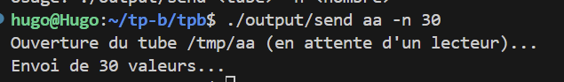
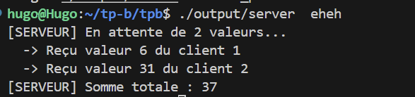

# TPC-Communication inter-processus sous linux - Partie II


# 2. Tubes (aka « pipes »)

### 2a) Vous devez écrire un programme qui se « forke » :
###   Le processus parent devra envoyer « n » valeurs aléatoires comprises entre 0 et 9 au processus fils a travers un tube. La valeur de « n » est comprise entre 5 et 20.
### Le processus fils devra lire les toutes les valeurs qui lui sont transmises, calculer leur somme et quitter.
### Le processus parent doit se terminer lorsque le processus fils a fini sa tache.
Programme somme des valeur aleatoire : 

```c
#include <stdio.h>
#include <stdlib.h>
#include <unistd.h>
#include <time.h>
#include <sys/wait.h>

int main() {
    int pipe_fds[2];
    pid_t pid;
    int n, val, sum = 0;
    // Création du tube
    if (pipe(pipe_fds) == -1) {
        perror("pipe");
        return 1;
    }
    // Création du processus
    pid = fork();

    if (pid == -1) {
        perror("fork");
        return 1;
    }

    if (pid == 0) { 
        //FILS
        close(pipe_fds[1]); 

        printf("FILS En attente de données...\n");
        
        //  tant que le tube est ouvert 
        while (read(pipe_fds[0], &val, sizeof(int)) > 0) {
            printf("FILS Reçu : %d\n", val);
            sum += val;
        }

        printf("FILS Somme totale : %d\n", sum);
        close(pipe_fds[0]);
        exit(0);

    } else { 
        // PERE 
        close(pipe_fds[0]); 
        
        srand(time(NULL));
        // n entre 5 et 20
        n = 5 + (rand() % 16); 
        
        printf("PERE Envoi de %d valeurs...\n", n);

        for (int i = 0; i < n; i++) {
            val = rand() % 10; // Valeur entre 0 et 9
            write(pipe_fds[1], &val, sizeof(int));
        }

        // Fermer le tube envoie EOF au fils
        close(pipe_fds[1]); 
        
        // Attendre la fin du fils
        wait(NULL);
        printf("PERE Le fils a terminé. Fin du programme.\n");
    }

    return 0;
}
```


### 2b) Quelle est le rôle/intérêt de la commande dup2?
L'intérêt de la commande dup2 est de duppliquer un descripteur de fichier. Elle permet la redirection des entrés / sorties standards.

### 2c)A quoi servent les commandes popen et pclose?
popen : crée un pipe, renvoie un pointeur de fichier permettant de lire la sortie de la commande comme si c'était un fichier classique. 

# 3. Tubes nommés (FIFO, aka « named pipe »)

### 3a) Vous devez écrire deux programme sans nécessairement utiliser fork
###    Le premier programme appelé send_rand qui écrit « n » valeurs aléatoires dans un tube nommé. Ce programme prendra en argument le nom du tube, et l'option -n qui sera suivi du nombre de valeurs aléatoires à envoyer dans le tube. Ce programme devra créer le tube dans le répertoire /tmp si celui-ci n'existe pas déjà. Exemple de syntaxe : send_rand mypipe -n 30 qui enverra 30 valeurs aléatoires dans le tube nommé « mypipe »
###    Le second programme appelé get_rand lira toutes les valeurs présentes dans le tube, et affichera la moyenne des valeurs avant de quitter.

send.c : 
```c
#include <stdio.h>
#include <stdlib.h>
#include <fcntl.h>
#include <sys/stat.h>
#include <unistd.h>
#include <time.h>
#include <string.h>

int main(int argc, char *argv[]) {
    /* Vérification arguments : send_rand <nom> -n <nombre> */
    if (argc < 4 || strcmp(argv[2], "-n") != 0) {
        printf("Usage: %s <tube> -n <nombre>\n", argv[0]);
        return 1;
    }

    /* Construction du chemin dans /tmp */
    char path[256];
    snprintf(path, sizeof(path), "/tmp/%s", argv[1]);

    /* Création du tube (ignorer erreur si existe déjà) */
    mkfifo(path, 0666);
    
    printf("Ouverture du tube %s (en attente d'un lecteur)...\n", path);
    /* O_WRONLY bloque jusqu'à ce qu'un lecteur ouvre le tube */
    int fd = open(path, O_WRONLY);
    if (fd == -1) return 1;

    int n = atoi(argv[3]);
    srand(time(NULL));
    
    printf("Envoi de %d valeurs...\n", n);
    for (int i = 0; i < n; i++) {
        int val = rand() % 100;
        write(fd, &val, sizeof(int));
    }

    close(fd);
    return 0;
}
```
get.c :
```c
#include <stdio.h>
#include <fcntl.h>
#include <unistd.h>
#include <string.h>

int main(int argc, char *argv[]) {
    if (argc < 2) {
        printf("Usage: %s <tube>\n", argv[0]);
        return 1;
    }

    char path[256];
    snprintf(path, sizeof(path), "/tmp/%s", argv[1]);

    printf("Attente de données sur %s...\n", path);
    int fd = open(path, O_RDONLY);
    if (fd == -1) {
        perror("Erreur ouverture (lancez send_rand d'abord ?)");
        return 1;
    }
    
    int val, count = 0;
    long sum = 0;

    /* Lecture tant qu'il y a des données (EOF = 0) */
    while (read(fd, &val, sizeof(int)) > 0) {
        sum += val;
        count++;
    }

    if (count > 0) {
        printf("Reçu %d valeurs.\n", count);
        printf("Moyenne : %.2f\n", (float)sum / count);
    } else {
        printf("Aucune donnée reçue.\n");
    }
    
    close(fd);
    /* Optionnel : supprimer le tube après usage */
    unlink(path);
    return 0;
}
```


# 4.Socket
### 4a)En utilisant les sockets UNIX, vous devez écrire un programme client et un serveur. Le client enverra une valeur numérique unique au serveur via les sockets UNIX. Ce client sera exécuté simultanément 2 fois. Chacun des processus contactera le même serveur et chacun devra envoyer une valeur aléatoire au serveur via les sockets. Le processus serveur attendra d’avoir deux valeurs numériques. Il devra alors calculer la somme des deux valeurs, l’afficher

On doit envoyer au serveur via le client un chiffre aléatoire et le serveur doit l'afficher dans la console puis en renvoyer une autre via le client en
ensuite faire la somme des deux et l'afficher sur le serveur.

server.c : 
```c
#include <stdio.h>
#include <stdlib.h>
#include <unistd.h>
#include <sys/socket.h>
#include <sys/un.h>
#include <string.h>

int main(int argc, char *argv[]) {
    if (argc < 2) { printf("Usage: %s <socket_path>\n", argv[0]); return 1; }

    int sock = socket(PF_LOCAL, SOCK_STREAM, 0);
    struct sockaddr_un addr = { .sun_family = AF_LOCAL };
    strncpy(addr.sun_path, argv[1], sizeof(addr.sun_path) - 1);

    unlink(argv[1]); 
    if (bind(sock, (struct sockaddr*)&addr, sizeof(addr)) == -1) { perror("bind"); return 1; }
    listen(sock, 5);

    printf("[SERVEUR] En attente de 2 valeurs...\n");

    int sum = 0;
    for (int i = 0; i < 2; i++) {
        int client = accept(sock, NULL, NULL);
        if (client == -1) continue;

        int val = 0;
        if (read(client, &val, sizeof(int)) > 0) {
            printf("  -> Reçu valeur %d du client %d\n", val, i+1);
            sum += val;
        }
        close(client);
    }

    printf("[SERVEUR] Somme totale : %d\n", sum);

    close(sock);
    unlink(argv[1]);
    return 0;
}
```

client.c : 
```c
#include <stdio.h>
#include <stdlib.h>
#include <unistd.h>
#include <sys/socket.h>
#include <sys/un.h>
#include <string.h>
#include <time.h>

int main(int argc, char *argv[]) {
    if (argc < 2) { printf("Usage: %s <socket_path>\n", argv[0]); return 1; }

    int sock = socket(PF_LOCAL, SOCK_STREAM, 0);
    struct sockaddr_un addr = { .sun_family = AF_LOCAL };
    strncpy(addr.sun_path, argv[1], sizeof(addr.sun_path) - 1);

    if (connect(sock, (struct sockaddr*)&addr, sizeof(addr)) == -1) {
        perror("connect"); return 1;
    }

    /* Génération aléatoire (basée sur le PID pour varier entre processus simultanés) */
    srand(time(NULL) ^ getpid());
    int val = rand() % 100;

    printf("[CLIENT %d] Envoi de %d\n", getpid(), val);
    write(sock, &val, sizeof(int));

    close(sock);
    return 0;
}
```


On a donc ici sur le serveur la somme de 6 + 31 deux nombres aléatoires envoyé par le client sur le socket "eheh"
