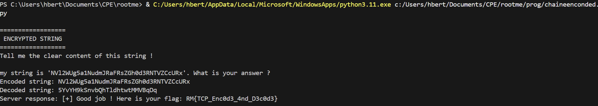

#  	TCP - Chaine Encodée

Lien vers le challenge : [Challenge](https://www.root-me.org/fr/Challenges/Programmation/TCP-Chaine-encodee)

## Énoncé : 


## Procédure : 
1. Analyse et Connexion : Connexion au serveur via un socket TCP. Le serveur envoie un message contenant une chaîne encodée entourée de guillemets simples.

2. Extraction dynamique : Contrairement au challenge précédent, j'ai utilisé une expression régulière (Regex) pour isoler proprement le contenu situé entre les guillemets ('...'). Cela rend le script plus robuste si la longueur du message change.

3. Décodage : La chaîne extraite est encodée en Base64. Utilisation de la librairie standard pour la décoder en texte clair.

4. Validation : Envoi de la chaîne décodée (suivie d'un saut de ligne \n) au serveur pour valider l'épreuve et obtenir le flag.
## Code : 

```py

import base64
import socket
import re # Expressions régulières pour isoler la chaîne
HOST = "challenge01.root-me.org"  
PORT = 52023 

with socket.socket(socket.AF_INET, socket.SOCK_STREAM) as s:
    s.connect((HOST, PORT))

    #recup la data
    data = s.recv(4096).decode('utf-8')
    print(data)
    
    match = re.search(r"'(.*?)'", data) #expression reguliere pour recup la chaine entre les quotes


    if match: #si on a un match :
        encoded_string = match.group(1) #on recup la chaine
        print("Encoded string:", encoded_string)


        decoded_string = base64.b64decode(match.group(1)).decode('utf-8') #on decode la chaine
        print("Decoded string:", decoded_string)

        response = decoded_string + "\n"  #on prepare la reponse en ajoutant un saut de ligne
        s.send(response.encode('utf-8'))  #on envoie la reponse

        result= s.recv(4096)  #on recupere la reponse du serveur
        print("Server response:", result.decode('utf-8'))

    else:
        print("No encoded string found in the received data.")

```

## Résultat :
On obtient donc le flag en executant le code : 




## Flag : 

Le Flag est : *RM{TCP_Enc0d3_4nd_D3c0d3}*

