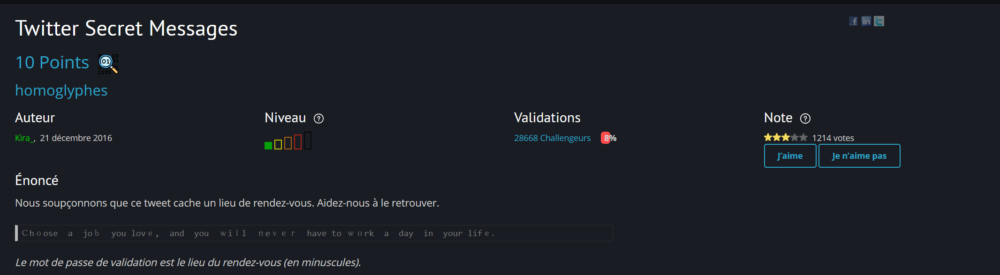
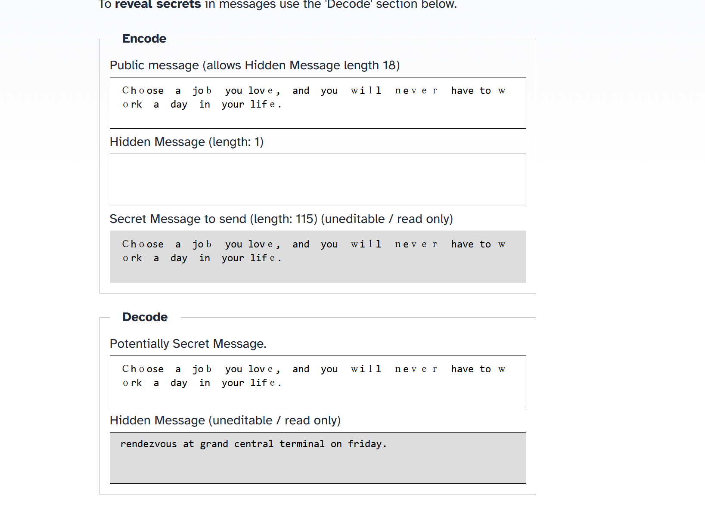
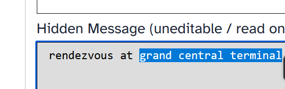

# Twitter Secret Message
Lien vers le challenge : [Challenge](https://www.root-me.org/fr/Challenges/Steganographie/Twitter-Secret-Messages)

# Énoncé :


## Procédure : 

On récupère le message codé : 
```
Ｃhｏose  a  jοｂ  yоu 
lονｅ,  and  you  ｗіｌl  ｎeｖｅｒ  have 
tο 
ｗｏrk  a  day  in  yοur
 lіfｅ．   
```

On peut ensuite utiliser ce site (ou un autre) : https://holloway.nz/steg/

On copie colle le texte et on obtient le lieu de rendez vous.



Maintenant il reste plus qu'à récuperer le lieu de rendez vous en question : 



On a le flag : grand central terminal