# Pickle Rick CTF

## Procédure : 

### FLAG 1 :
On commence avec un scan : 

On voit qu'on peut aller sur le port 80 donc http : 
http://10.82.134.213/

On arrive sur cette page :

En inspectant le code source on à : 
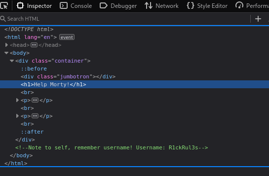
On récupère donc l'username : 
    - *R1ckRul3s*
On a donc un username.

On utilise ensuite gobuster pour découvrir les directory qu'on peut utiliser : 

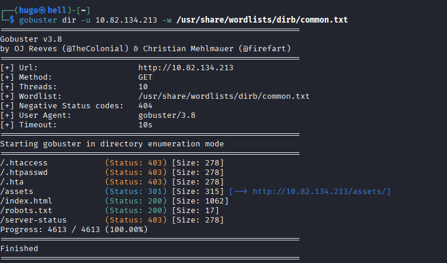

On a donc pleins de choses intéressantes :
    -robots.txt
    -/assets

On va commencer par robots.txt : 
http://10.82.134.213/robots.txt

on va curl ca : 
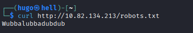

On a : *Wubbalubbadubdub*

On essaye maintenant de se connecter à http://<ip>/login.php
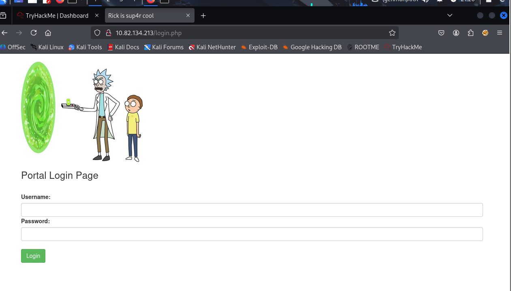
Ca marche, 

On essaye l'user et le mdp :
user : *R1ckRul3s*
psswd : *Wubbalubbadubdub*

On arrive sur http://10.82.134.213/portal.php
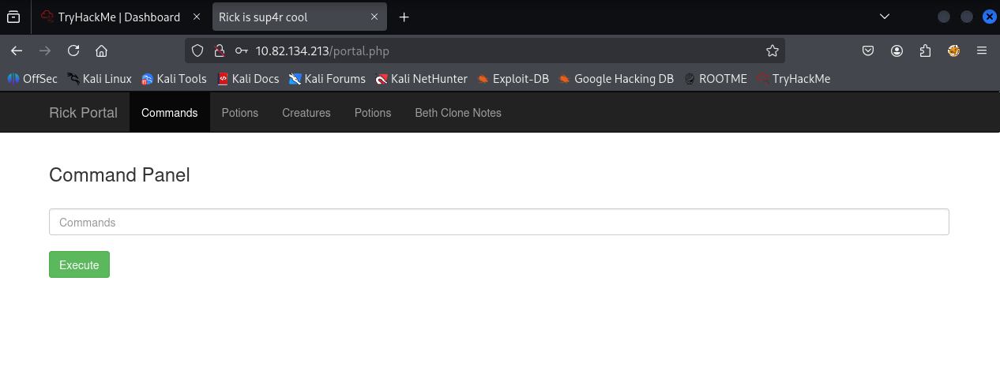

On voit donc maintenant un command pannel, c'est une console utilisable, on va tester des commandes :

*ls -l*
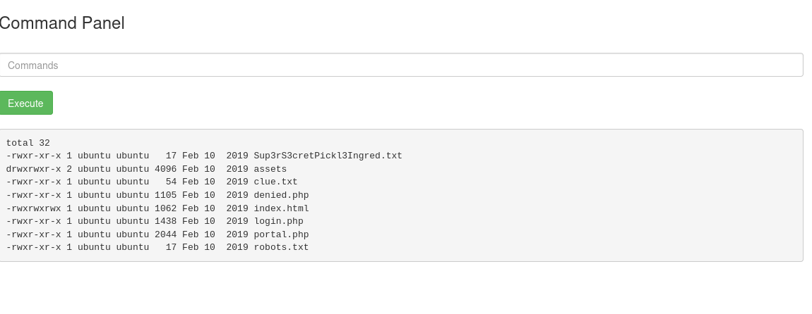

On a pleins de nouveau fichier à découvrir : 

On curl : http://10.82.134.213/Sup3rS3cretPickl3Ingred.txt

On à le premier ingrédient ! 

FLAG 1 : *mr. meeseek hair*

### FLAG 2:

On va se balader sur le système :

*ls /home/*

*ls /home/rick*
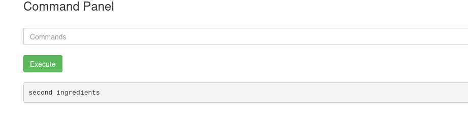

On va lire le fichier pour voir le nouveau flag : 
*less /home/rick/"second ingredients"*
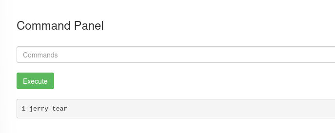

On a maintenant : *1 jerry tear*

FLAG 2 : *1 jerry tear*

### FLAG 3 : 

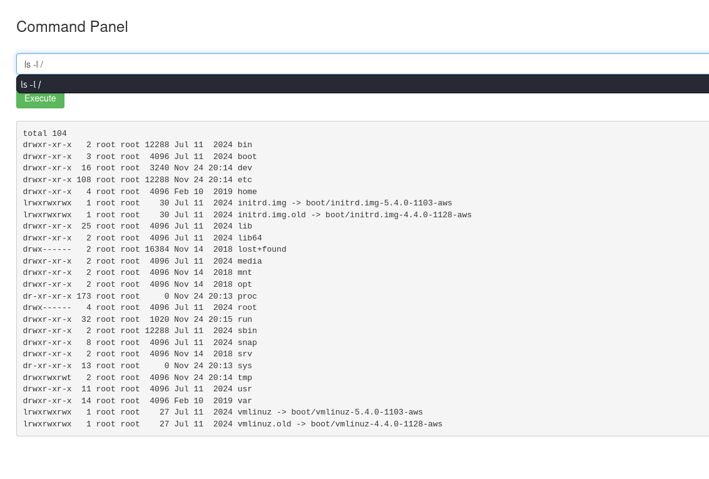

On recupère les privilèges assez facilement :
*sudo -l*
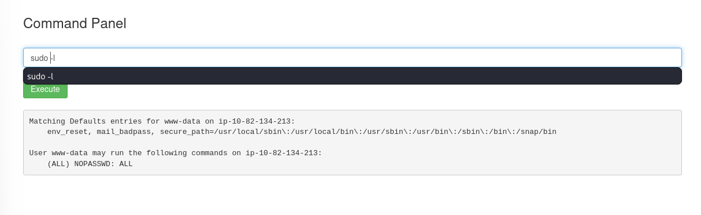

On peut donc utiliser sudo ici ! 

on va donc voir le dossier root : 
*sudo ls -l /root/*
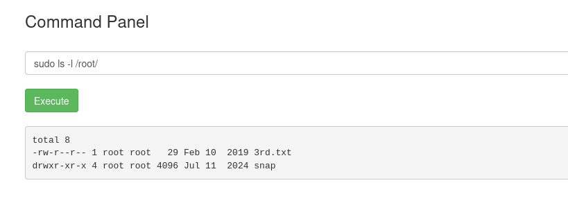

On peut pas utiliser cat donc on utilise less :

*sudo less /root/3rd.txt*

On obtient donc le troisième et dernier flag : 

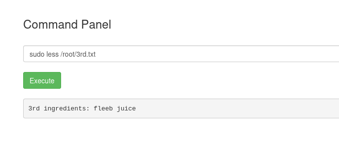

FLAG 3 : fleeb juice 

## On obtient donc les 3 flags et le CTF est terminé !